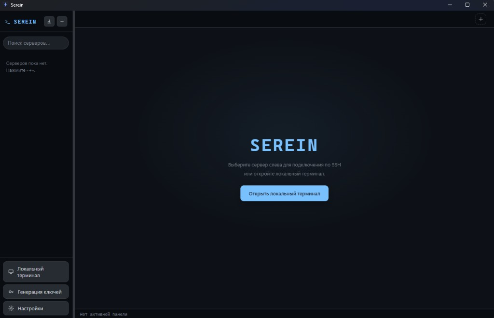

<div align="center">


# Serein

**Десктоп-клиент SSH / SFTP «всё в одном окне».**

Вкладки и сплит-панели, файловый менеджер SFTP со встроенным редактором,
проброс портов, мониторинг ресурсов, панель Docker и локальный терминал —
в установщике на **≈ 6 МБ**.

Бесплатно, открытый код, Apache 2.0. Windows x64, **v1.0.0**.

[](https://tauri.app)
[](https://www.rust-lang.org)
[](https://react.dev)
[](https://www.typescriptlang.org)
[](https://github.com/neoHaDe/Serein/actions/workflows/ci.yml)
[](#-лицензия)

Windows · без своего Chromium (системный WebView2) ·
[English version](README.en.md)

### → [Скачать последний выпуск](../../releases/latest)



</div>

---

## ✨ Почему Serein

Интерфейс в системном WebView, SSH / SFTP / шифрование / PTY — в одном Rust-бинарнике.
Не тащим Chromium. Не пытаемся обогнать Tabby списком галочек: цель — **рабочее место
по серверу** (терминал, файлы, Docker, логи, ресурсы, туннели), а не «ещё один SSH-клиент».

| | **Serein (Tauri)** | Типичный Electron-клиент |
| --- | :---: | :---: |
| Размер установщика | **≈ 6 МБ** | ≈ 85 МБ |
| Память в простое | **≈ 33 МБ** | 150–250 МБ |
| SSH-движок | чистый Rust [`russh`](https://github.com/Eugeny/russh) | libssh2 / нативный |
| Рантайм | системный WebView2 | полный Chromium |

Цифры — живой `tauri dev` (RAM) и NSIS 1.0.0 (~6.1 МБ сжатый). На слабом ноутбуке те же 33 МБ не обещаем.

---

## 🚀 Возможности

### Терминал и UX
- **Несколько SSH-вкладок** + **сплит-панели** (дерево с перетаскиванием границ, выбор сервера на панель)
- **Локальный терминал** с умным выбором shell (PowerShell → cmd, либо свой / WSL)
- Поиск (`Ctrl+F`), зум, **17 тем на весь интерфейс**, **компактный режим**
- **Своя рамка окна** (без хрома Windows): свернуть / развернуть / закрыть
- **Broadcast-ввод** (в пределах текущей вкладки), восстановление вкладок, перетаскивание вкладок
- Навигация по панелям с клавиатуры, настраиваемые хоткеи, **командная палитра** (`Ctrl+Shift+P`)

### Подключения
- Сайдбар с группами и поиском, **живой статус подключения**
- Аутентификация: **пароль · ключ · keyboard-interactive 2FA**
- **ProxyJump / бастион** — цепочки (рекурсивно, через `direct-tcpip`)
- **TOFU-проверка known-hosts** на каждом хопе
- **Переподключение при обрыве** — вручную или авто (до 5 попыток, бэкофф)
- Импорт из **`~/.ssh/config`** и сессий **PuTTY**

### Файлы (SFTP)
- Просмотр с **кликабельными хлебными крошками**, **инлайн-переименование**, drag & drop внутрь окна
- **Рекурсивные передачи** с прогрессом и **отменой конкретного файла** (✕)
- Двухпанельный режим (локально ↔ сервер); **SFTP можно открепить** в отдельное окно
- **Ctrl+колёсико** (и Ctrl+/−/0) меняет масштаб текста в SFTP и логах
- **Встроенный редактор** (CodeMirror 6) — атомарное сохранение прямо на сервер
- **Внешний редактор** — открывает файл в редакторе ОС и сам заливает при сохранении

### Туннели и эксплуатация
- Проброс портов: **локальный `-L`**, **обратный `-R`**, **динамический SOCKS5 `-D`** (открытие туннеля можно прервать)
- **Мониторинг ресурсов** — CPU / RAM / диск / load (опрос `/proc` + `df`)
- **Панель Docker** — список, старт/стоп/рестарт/удаление, shell в контейнер
- **Логи Docker** — цвет уровней, follow (`-f`) со стопом, широкая панель; **открепить** на второй монитор

### Окна
- Откреплённые логи и SFTP — отдельные окна ОС, без рамки Windows
- **Магнит**: окна стыкуются вплотную и по направляющим (края / центр)
- Группу тащит главное окно; доп. окно отцепляется, если потянуть за него
- Клик по любому окну поднимает **все** окна Serein; по умолчанию **одна кнопка** на панели задач
  (в настройках можно вернуть отдельные кнопки)

### Безопасность и хранение
- Секреты шифруются через **DPAPI** + опциональный **мастер-пароль**
  (scrypt → AES-256-GCM); в UI пароли и ключи не отдаются
- Зашифрованный **бэкап `.tbk`** серверов, настроек и сниппетов
- **Генерация SSH-ключей** (ed25519 / RSA) + `ssh-copy-id`

---

## Быстрый старт

1. Поставь установщик или скачай portable `Serein_1.0.0_x64-portable.exe` из [Releases](../../releases/latest).
2. Импортируй `~/.ssh/config` или добавь сервер вручную.
3. Подключись. Локальный терминал работает и без SSH.

Цель: установка → первое соединение меньше чем за две минуты.

---

## Что нужно

| Требование | Ответ |
| --- | --- |
| Система | Windows 10 x64 **22H2+** или Windows 11 x64. macOS и Linux пока не собираются |
| WebView2 | уже есть в актуальном Windows; отдельно ставить не нужно |
| Права | администратор для повседневной работы не нужен |
| Сборка из исходников | Node **18.18+** (проверено на 24.16), Rust **stable** `x86_64-pc-windows-msvc` (проверено на 1.96.0), Tauri CLI **2.11.x** |
| SSH-агент | **пока нет** — пароль, файл ключа или keyboard-interactive |

Матрица и smoke: [`docs/PHASE0.md`](docs/PHASE0.md).

---

## 📦 Установка

С [Releases](../../releases/latest):

- **`Serein_1.0.0_x64-setup.exe`** — установщик (меню Пуск, удаление).
- **`Serein_1.0.0_x64-portable.exe`** — один файл, без установки. Положи и запусти. Настройки всё равно в `%APPDATA%\serein`.

Сборка **не подписана** — SmartScreen ругнётся. *Подробнее → Выполнить в любом случае*.
Проверяй SHA-256 из описания выпуска, если он там есть.

Автообновление в конфиге заведено (`nehade.xyz/updates/terminal/`), на неподписанном
установщике на него не рассчитывай.

---

## 🛠 Стек

| Слой | Технологии |
| --- | --- |
| Оболочка | **[Tauri 2](https://tauri.app)** (Rust, системный WebView2) |
| Фронтенд | **React 18** · **TypeScript 5** · **Vite** |
| Терминал | [`@xterm/xterm`](https://xtermjs.org) |
| Редактор | [CodeMirror 6](https://codemirror.net) |
| SSH / SFTP | [`russh`](https://github.com/Eugeny/russh) · [`russh-sftp`](https://github.com/AspectUnk/russh-sftp) |
| Локальный PTY | [`portable-pty`](https://crates.io/crates/portable-pty) |
| Криптография | `aes-gcm` · `scrypt` · `ssh-key` · Windows DPAPI |

---

## 🏗 Архитектура

```
┌─────────────────────────── WebView (React) ───────────────────────────┐
│  App · TabBar · Sidebar · SftpPanel · Monitor · Docker · CodeEditor    │
│  └── src/api  ──  мост window.api  (invoke / listen)                   │
└───────────────────────────────┬───────────────────────────────────────┘
                     команды и события Tauri
┌───────────────────────────────┴───────────────────────────────────────┐
│  Rust-бэкенд (src-tauri/src)                                           │
│  ssh · sftp · tunnels · monitor · docker · pty · store · vault ·       │
│  crypto · dpapi · keygen · importers · knownhosts · remoteedit         │
└────────────────────────────────────────────────────────────────────────┘
```

- React говорит с Rust через тонкий мост `window.api` (invoke / listen).
- Одно SSH-соединение мультиплексирует **shell + SFTP + exec + туннели**; handle берётся
  коротким async-локом, каналы не ждут друг друга.
- Секреты расшифровываются **только в Rust**, в момент подключения. Вне Windows DPAPI нет:
  там запасной `plain:` (эта сборка — Windows).

---

## 👩‍💻 Сборка из исходников

Нужны [Rust](https://rustup.rs) (stable) и [Node.js](https://nodejs.org) 18+.
В неинтерактивном PowerShell `cargo` часто не в PATH — добавь `$env:USERPROFILE\.cargo\bin`.

Dev-сервер слушает **`127.0.0.1:1420`**, не `localhost` (IPv4/IPv6 иначе вечно «Waiting for frontend»).

```bash
npm install
npm run tauri dev
npm run tauri build
```

Установщик: `src-tauri/target/release/bundle/nsis/`.

```bash
npm run smoke
```

(`tsc --noEmit` + `cargo check`. Сценарий целиком — `docs/PHASE0.md`.)

---

## Данные и диагностика

Профили, секреты, known_hosts, vault — в `%APPDATA%\serein\`
(`servers.json`, `secrets.json`, `vault.json`, `known_hosts.json`, …).

Секреты в UI-слой не едут. Логи отдельным файлом пока не пишем: смотри окно приложения
и вывод `npm run tauri dev`.

---

## Известные ограничения

- Нет **SSH-агента** и **agent-forwarding**.
- Нет drag-out файла на рабочий стол.
- Нет очереди передач как у «менеджера загрузок»: пауза / повтор / несколько файлов параллельно. Отмена текущего файла — есть.
- Сборки только под **Windows x64**. `.dmg` / `.AppImage` нет.
- Установщик **без цифровой подписи**. SmartScreen будет спорить.
- Не цель ближайших релизов: облачный sync, мобилка, плагины, Telnet/RDP/VNC, «просто чат с LLM».

Дорожная карта продукта: Server Workspace, потом Copilot. Слой «надёжный SSH» — сначала.

---

## 📄 Лицензия

[Apache License 2.0](LICENSE) © 2026 HaDe
