# Serein - инструкция пользователя

Здесь по порядку рассказано, что есть в Serein, где это найти и как этим пользоваться.
Читать подряд не обязательно: оглавление ниже ведёт сразу к нужному разделу.

## Оглавление

1. [Установка и первый запуск](#1-установка-и-первый-запуск)
2. [Как устроено окно](#2-как-устроено-окно)
3. [Серверы: добавить, изменить, упорядочить](#3-серверы-добавить-изменить-упорядочить)
4. [Подключение](#4-подключение)
5. [Терминал](#5-терминал)
6. [Обзор сервера](#6-обзор-сервера)
7. [Файлы](#7-файлы)
8. [Docker](#8-docker)
9. [Логи сервера](#9-логи-сервера)
10. [Процессы](#10-процессы)
11. [Службы](#11-службы)
12. [Туннели (проброс портов)](#12-туннели-проброс-портов)
13. [Базы данных](#13-базы-данных)
14. [Рабочий стол: VNC и RDP](#14-рабочий-стол-vnc-и-rdp)
15. [Утилиты](#15-утилиты)
16. [Одна команда на нескольких серверах](#16-одна-команда-на-нескольких-серверах)
17. [Задачи](#17-задачи)
18. [Профили рабочего пространства](#18-профили-рабочего-пространства)
19. [SSH-ключи](#19-ssh-ключи)
20. [Локальный терминал, COM-порт и telnet](#20-локальный-терминал-com-порт-и-telnet)
21. [Настройки](#21-настройки)
22. [Журнал действий](#22-журнал-действий)
23. [Горячие клавиши](#23-горячие-клавиши)
24. [Если что-то не получается](#24-если-что-то-не-получается)

---

## 1. Установка и первый запуск

### Какой файл скачать

Все файлы лежат на странице [выпусков](../../../../releases/latest).

| Система | Файл | Что это |
| --- | --- | --- |
| Windows | `Serein_…_x64-setup.exe` | Обычный установщик: ярлык в меню «Пуск», удаление через «Приложения» |
| Windows | `Serein_…_x64-portable.zip` | Без установки: распакуйте в любую папку и запустите `Serein.exe` |
| Debian, Ubuntu, Astra | `Serein_…_amd64.deb` | `sudo apt install ./Serein_…_amd64.deb` |
| Fedora | `Serein-…-1.x86_64.rpm` | `sudo dnf install ./Serein-…-1.x86_64.rpm` |
| Любой Linux | `Serein_…_amd64.AppImage` | Один файл: сделайте его исполняемым и запустите |

Программа для Windows пока не подписана, поэтому при первом запуске SmartScreen может
показать предупреждение. Нажмите «Подробнее», затем «Выполнить в любом случае». Если хотите
убедиться, что файл не подменили, сверьте его сумму SHA-256 с той, что опубликована в
описании выпуска.

### Первый запуск

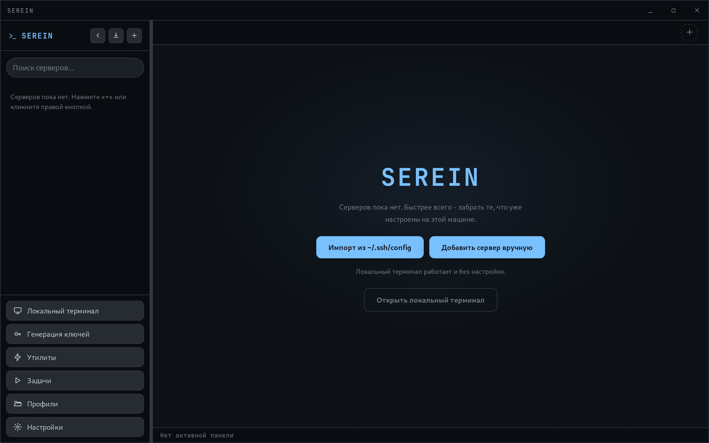

Список серверов пока пуст. Добавить их можно тремя способами:

- **Импорт из `~/.ssh/config`** - если вы уже ходите на серверы через `ssh` из консоли,
  Serein заберёт их оттуда вместе с пользователями, портами, ключами и шлюзами.
- **Добавить сервер вручную** - заполнить карточку сервера (об этом в
  [разделе 3](#3-серверы-добавить-изменить-упорядочить)).
- **Открыть локальный терминал** - обычная консоль этого компьютера, серверы для неё не
  нужны.

Все данные Serein хранит у вас: в `%APPDATA%\serein` на Windows и в `~/.config/serein` на
Linux. Точный путь показан в самом низу настроек.

---

## 2. Как устроено окно

- **Слева - список серверов.** Сверху поиск, ниже серверы по группам, в самом низу
  кнопки: локальный терминал, генерация ключей, утилиты, задачи, профили и настройки.
  Когда вы подключаетесь к серверу, список сворачивается в узкую полосу, чтобы не
  занимать место. Развернуть его обратно - кнопка `›` в левом верхнем углу.
- **Сверху - вкладки.** Каждое подключение, открытый файл или утилиты - отдельная
  вкладка. Справа от вкладок кнопки для текущей вкладки: разделить окно, сниппеты,
  запись сессии, открепить в отдельное окно, туннели, файлы.
- **У вкладки сервера слева - список инструментов:** Terminal, Overview, Docker, Logs,
  Processes, Services, Tunnels, Desktop, Databases. Под ним кнопки «Переподключить»,
  «Редактировать», «Копировать user@host» и «Утилиты…».
- **Внизу - строка состояния:** подключено или нет, к какому адресу, задержка до сервера.

Почти всё, что есть в меню, доступно и с клавиатуры через командную палитру
(`Ctrl+Shift+P`, подробнее в [разделе 5](#командная-палитра)).

---

## 3. Серверы: добавить, изменить, упорядочить

### Импорт

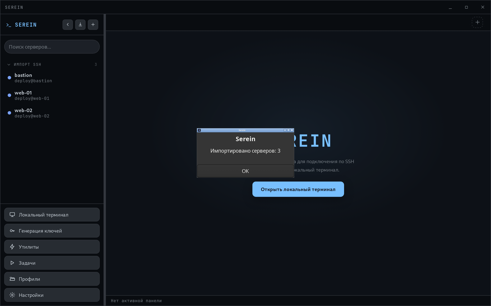

Кнопка со стрелкой вниз над списком открывает меню импорта:

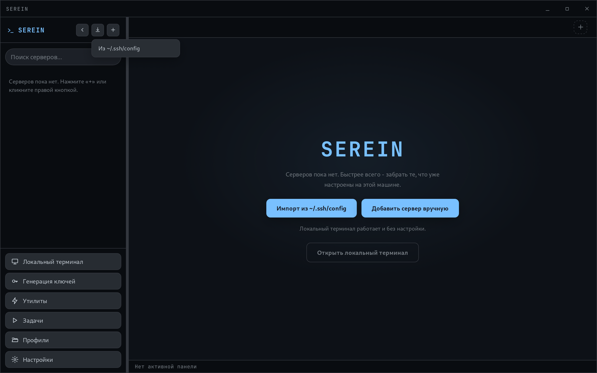

- **Из `~/.ssh/config`** - работает везде. Переносятся имя хоста, адрес, пользователь,
  порт, файл ключа и шлюз (`ProxyJump`). Если шлюз - один сервер из того же файла или из
  списка Serein, он подставится сам. Цепочку из нескольких шлюзов (`ProxyJump a,b`)
  перенести нельзя: такие серверы добавятся с прямым подключением, и Serein назовёт их
  после импорта, чтобы вы указали шлюз вручную. Повторный импорт не создаёт дублей.
- **Из PuTTY, MobaXterm, XShell и SecureCRT** - только на Windows, где эти программы
  живут.

Пароли ни из одного источника не переносятся: при первом подключении Serein их спросит.

### Добавить сервер вручную

Кнопка `+` над списком открывает карточку сервера.

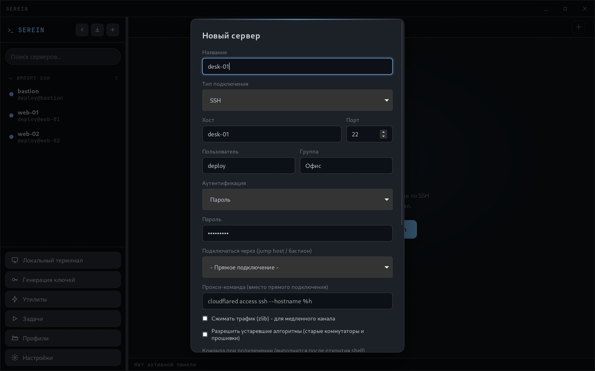

- **Название** - как сервер будет подписан в списке.
- **Тип подключения** - SSH, последовательный порт (COM), Telnet или TCP без обработки.
  Всё, что ниже, относится к SSH; про остальные типы - в
  [разделе 20](#20-локальный-терминал-com-порт-и-telnet).
- **Хост и порт** - адрес сервера и порт SSH, обычно 22.
- **Пользователь и группа** - имя, под которым входить, и группа в списке. Новая группа
  появится, как только вы впишете её имя.
- **Аутентификация:**
  - *Пароль* - хранится зашифрованным (на Windows - средствами системы, на Linux - в
    связке ключей).
  - *Приватный ключ* - путь к файлу ключа, кнопка «Обзор…» и парольная фраза, если она
    есть.
  - *SSH-агент* - ключи берутся из запущенного агента.

  Если сервер спросит одноразовый код (двухфакторный вход), Serein покажет окно для него.

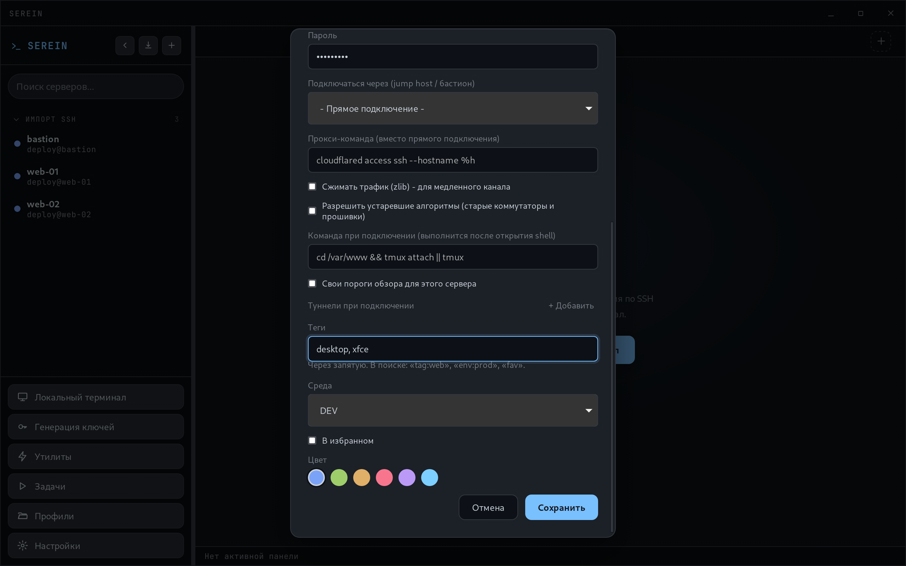

- **Подключаться через** - шлюз (бастион): сначала Serein подключается к нему, а уже
  через него к этому серверу. Шлюз выбирается из вашего же списка, и у него может быть
  свой шлюз.
- **Прокси-команда** - команда, которая сама устанавливает соединение (например,
  `cloudflared`). Используется, только если шлюз не выбран.
- **Сжимать трафик** - помогает на медленном канале.
- **Разрешить устаревшие алгоритмы** - для старых коммутаторов и прошивок, которые не
  понимают современные алгоритмы SSH.
- **Команда при подключении** - выполнится сразу после входа, например
  `cd /var/www && tmux attach || tmux`.
- **Свои пороги обзора** - когда обзор сервера должен говорить «внимание» и «плохо»
  (по умолчанию пороги общие, из настроек).
- **Туннели при подключении** - проброс портов, который поднимается вместе с
  подключением (см. [раздел 12](#12-туннели-проброс-портов)).
- **Теги, среда, избранное, цвет** - помогают искать и не перепутать серверы. Сервер со
  средой PROD помечается в списке красным ярлыком.

Пример сервера за шлюзом:

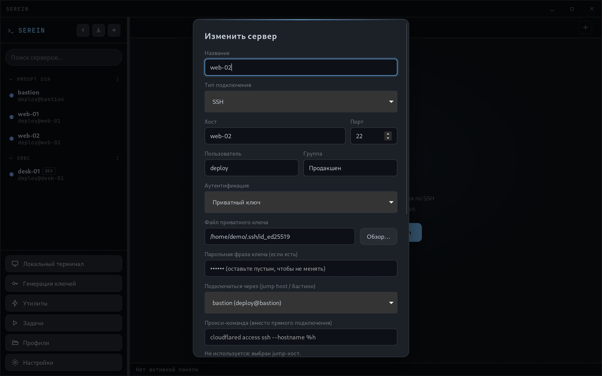

### Список серверов

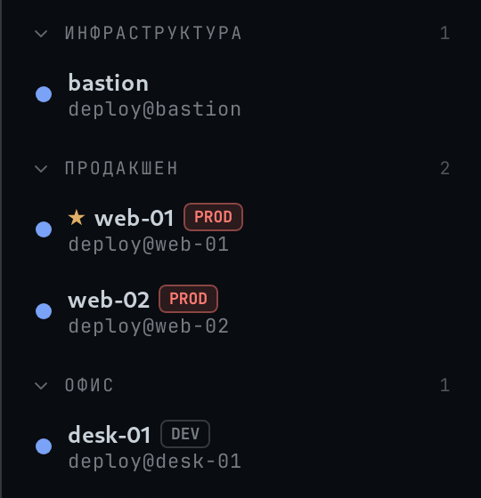

- **Поиск** понимает обычные слова, а также `tag:web`, `env:prod` и `fav` (избранные).
- **Кнопки справа** появляются при наведении: избранное, подключиться, изменить,
  удалить.
- **Перетаскивание** меняет порядок серверов и переносит их между группами.
- **Выделение нескольких** - `Ctrl` и `Shift`, как в проводнике. Правая кнопка по
  выделенным: подключиться ко всем, пометить средой, в избранное, убрать из группы,
  удалить.
- **Правая кнопка по пустому месту списка** - новый сервер, новая группа, выполнить
  команду на нескольких серверах, задачи, профили, настройки групп.

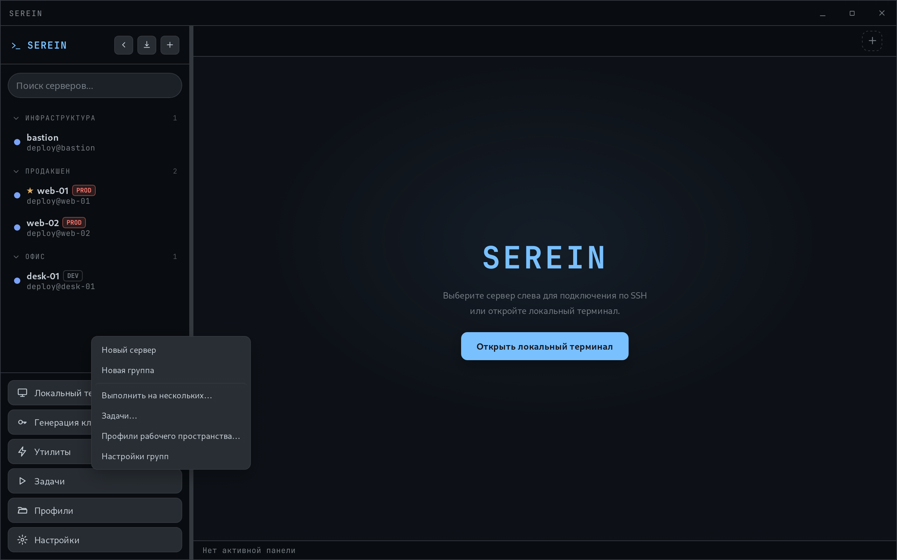

Перед удалением сервера Serein спрашивает подтверждение. Так же он переспрашивает перед
любым действием, которое нельзя отменить: удаление файлов, контейнеров, задач, остановка
служб и процессов, опасные запросы к базе.

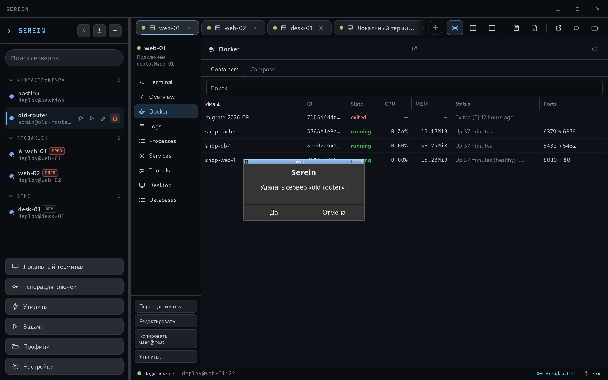

---

## 4. Подключение

Дважды щёлкните по серверу в списке (или нажмите кнопку подключения при наведении).

При **первом** подключении к серверу Serein показывает отпечаток его ключа:

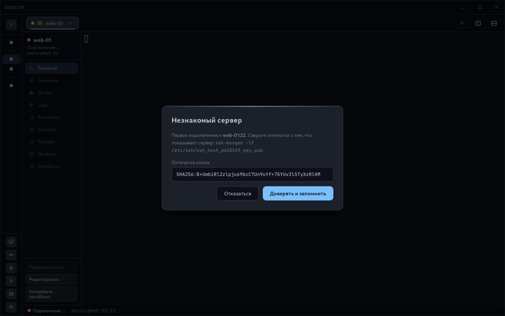

Это защита от подмены сервера. Если сомневаетесь, сверьте отпечаток с тем, что покажет
сам сервер (`ssh-keygen -lf /etc/ssh/ssh_host_ed25519_key.pub`), и нажмите «Доверять и
запомнить». В следующий раз вопроса не будет. Если ключ сервера когда-нибудь изменится,
Serein не станет подключаться молча и предупредит.

Для сервера за шлюзом вопрос задаётся по очереди: сначала про шлюз, потом про сам сервер.

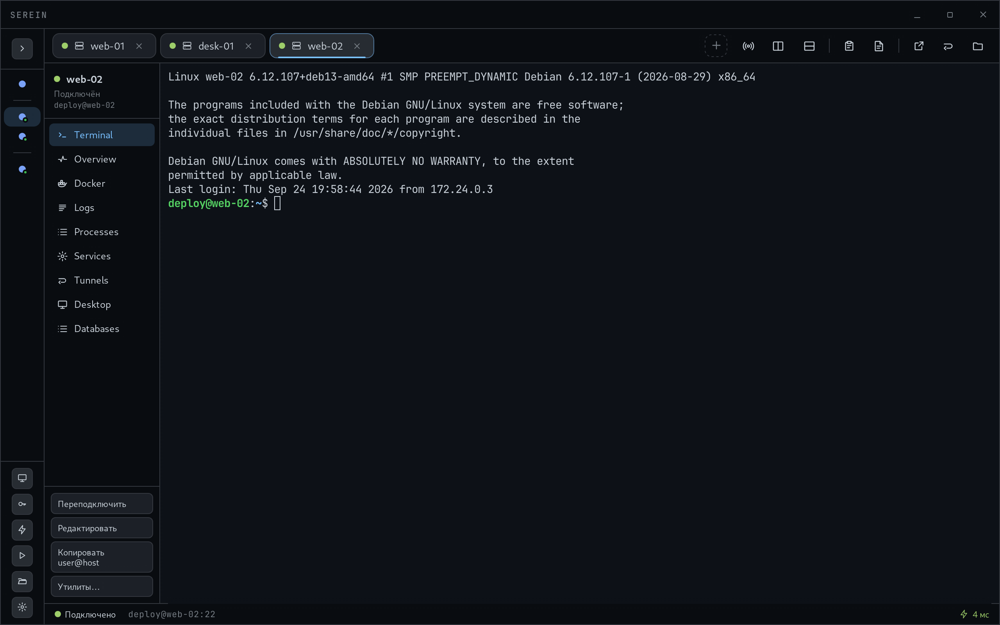

Если связь оборвалась, нажмите «Переподключить» слева или включите в настройках
автопереподключение (до 5 попыток).

---

## 5. Терминал

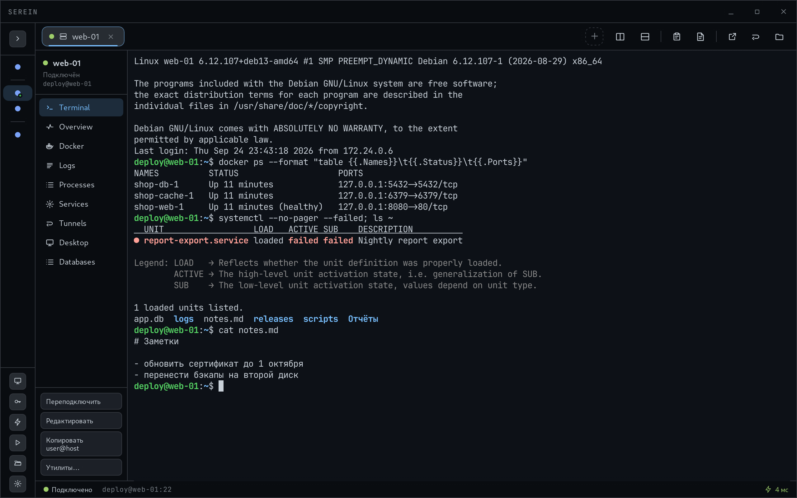

- **Копировать и вставить** - `Ctrl+Shift+C` и `Ctrl+Shift+V` (просто `Ctrl+C` в
  терминале прерывает команду, как и положено).
- **Поиск по выводу** - `Ctrl+F`.
- **Размер шрифта** - в настройках. Там же выбирается шрифт и цветовая схема.

### Разделение окна

Кнопки «Разделить по вертикали» и «Разделить по горизонтали» над вкладками спрашивают,
что открыть в новой панели: локальный терминал или любой сервер из списка.

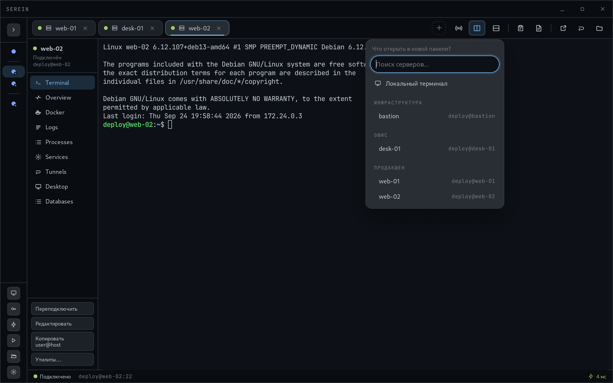

Границы между панелями можно перетаскивать, лишнюю панель закрывает крестик в её углу или
`Ctrl+Shift+X`. `Ctrl+Shift+E` и `Ctrl+Shift+D` делят окно сразу, без вопроса, и открывают
в новой панели локальный терминал.

### Ввод во все панели сразу

Кнопка с антенной (или `Ctrl+Shift+B`) включает одновременный ввод: всё, что вы
набираете, уходит во все панели текущей вкладки. Пока режим включён, в строке состояния
горит «Broadcast» с числом панелей.

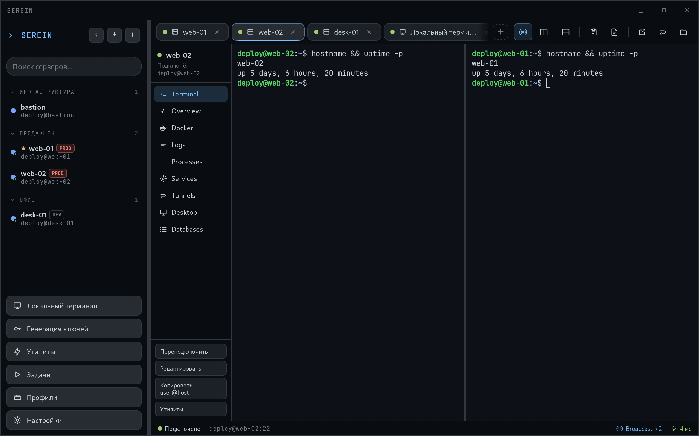

### Сниппеты

Кнопка с планшетом - ваши часто нужные команды. «+ Новый» добавляет команду с названием,
щелчок по ней вставляет и выполняет её в активной панели.

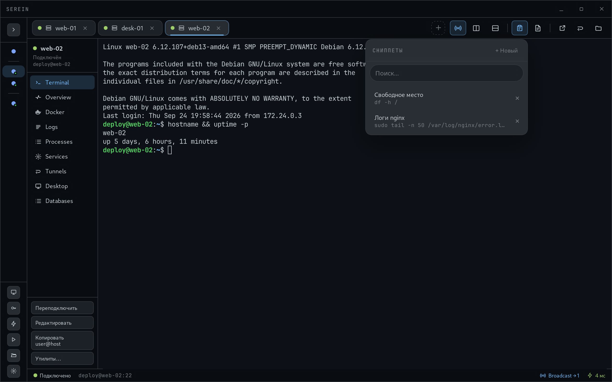

### Запись сессии

Кнопка с листком включает запись всего вывода терминала в файл (в папку `logs` рядом с
профилем, без цветовых кодов). Повторное нажатие останавливает запись.

### Отдельное окно

Кнопка со стрелкой наружу переносит вкладку в отдельное окно - например, на второй
монитор. Подключение при этом не рвётся, даже открытый рабочий стол продолжает работать.
Вернуть вкладку в главное окно - кнопка «Вернуть в главное окно» в заголовке нового окна.

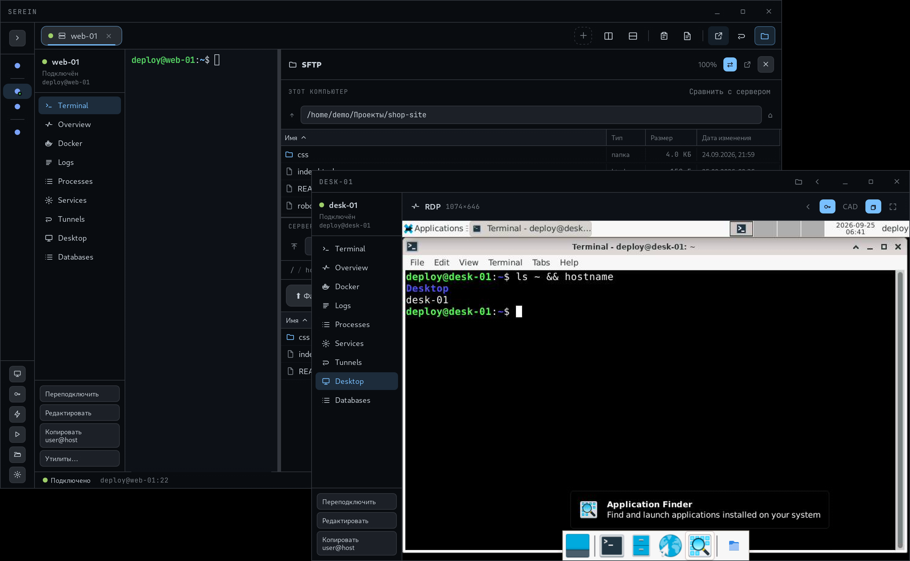

### Командная палитра

`Ctrl+Shift+P` открывает поиск по серверам и командам. Начните набирать имя сервера и
нажмите `Enter` - он подключится. Там же настройки, генерация ключей, утилиты, задачи,
журнал действий и профили.

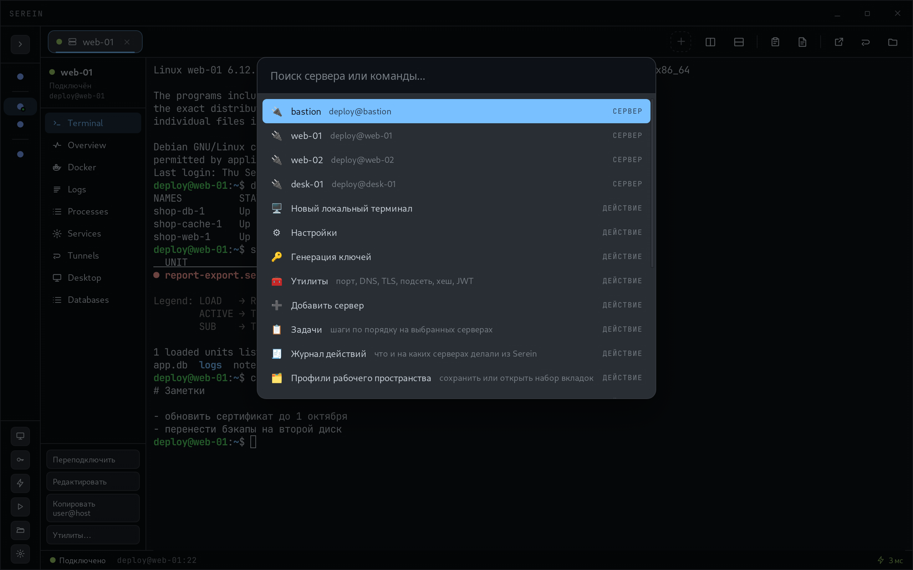

---

## 6. Обзор сервера

Инструмент **Overview** - состояние сервера на одном экране.

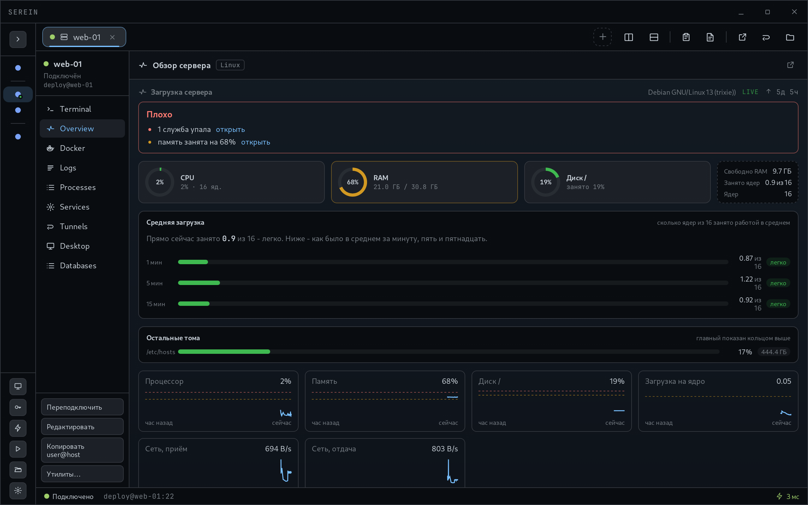

- **Оценка вверху**: «Норма», «Внимание» или «Плохо», и под ней причины. Щелчок по
  «открыть» у причины ведёт в нужный инструмент (упавшая служба - в Services).
- **Процессор, память, диск** и средняя загрузка - с пояснением словами, насколько
  сервер занят.
- **Графики за последний час**: процессор, память, диск, загрузка, сеть. История
  копится, пока открыта вкладка сервера, и переживает переключение вкладок.
- **Ниже**: процессор и видеокарта, объём памяти, система и ядро, число процессов, сеть,
  упавшие службы и контейнеры Docker - со ссылками в нужные инструменты.

Пороги «внимание» и «плохо» задаются в настройках или в карточке конкретного сервера.
Процессор становится причиной, только если держится выше порога 5 минут подряд.

---

## 7. Файлы

Кнопка с папкой справа над вкладками (или `Ctrl+Shift+F`) открывает файлы сервера сбоку
от терминала. Ширину панели можно менять, перетаскивая её границу.

### Две панели: компьютер и сервер

Кнопка `⇄` в шапке файлов включает двухпанельный режим: сверху папка на вашем
компьютере, снизу папка на сервере.

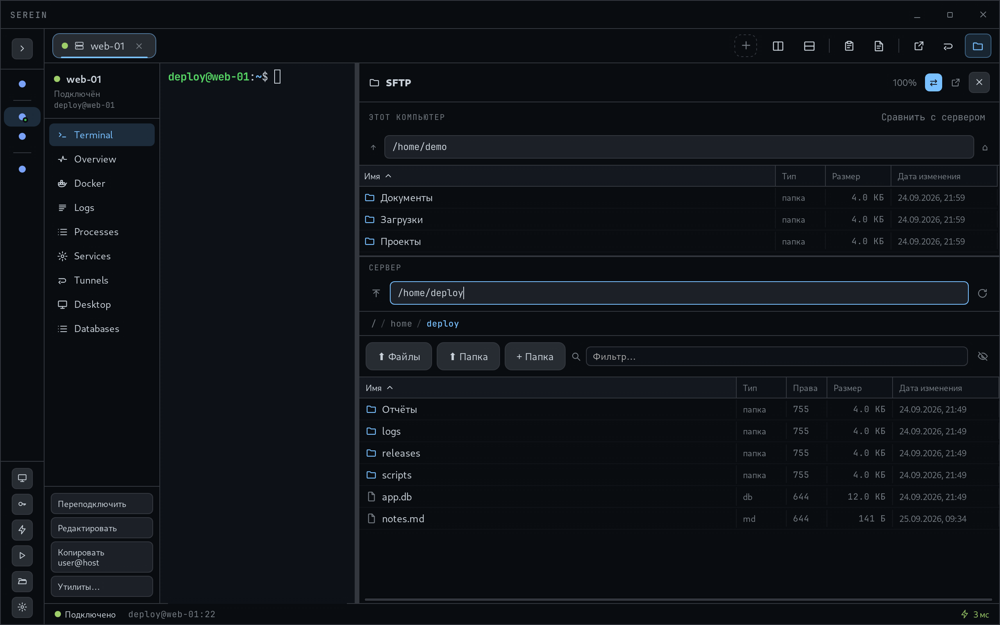

- **Переход по папкам** - двойной щелчок, строка пути или «хлебные крошки» над списком.
- **Загрузка на сервер** - перетащите файлы или папки из верхней панели в нижнюю, из
  проводника в панель сервера, или нажмите «⬆ Файлы» / «⬆ Папка».
- **Скачивание** - перетащите файл из панели сервера в проводник или на рабочий стол,
  либо выберите «Скачать» в меню файла.
- **Очередь передач** внизу показывает скорость, оставшееся время, паузу, отмену и повтор.
  Одновременно идёт до 4 передач (до 8 - в настройках).

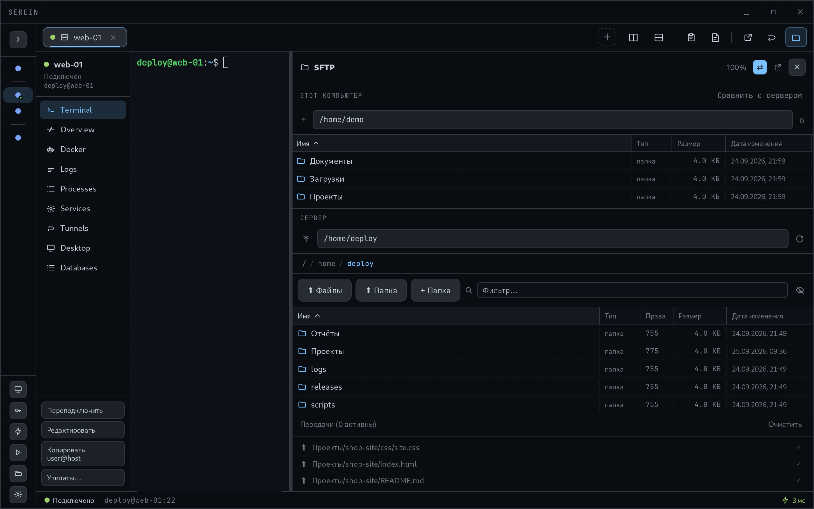

Файл на сервере сначала пишется во временный рядом с настоящим и заменяет его только в
конце, с прежними правами. Прерванная загрузка не оставит на сервере испорченный файл.

### Меню файла

Правая кнопка по файлу на сервере:

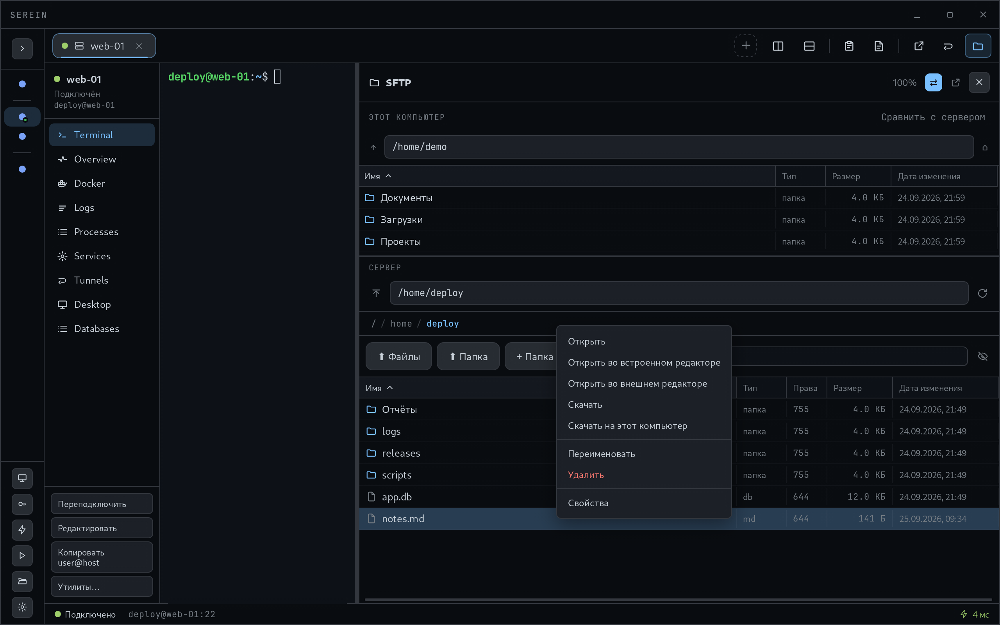

- **Открыть** - картинку покажет, текст откроет, папку раскроет.
- **Открыть во встроенном редакторе** - правка прямо в Serein.
- **Открыть во внешнем редакторе** - в редакторе вашей системы (или том, что указан в
  настройках). Когда вы сохраните файл там, Serein сам зальёт его обратно на сервер.
- **Скачать** - спросит, куда сохранить. **Скачать на этот компьютер** - в папку,
  открытую в верхней панели.
- **Переименовать, Удалить, Свойства**. Права доступа меняются щелчком по столбцу
  «Права».

Скрытые файлы показывает кнопка с глазом у фильтра, колонки настраиваются правой кнопкой
по заголовку таблицы, масштаб - `Ctrl` + колесо мыши.

### Встроенный редактор

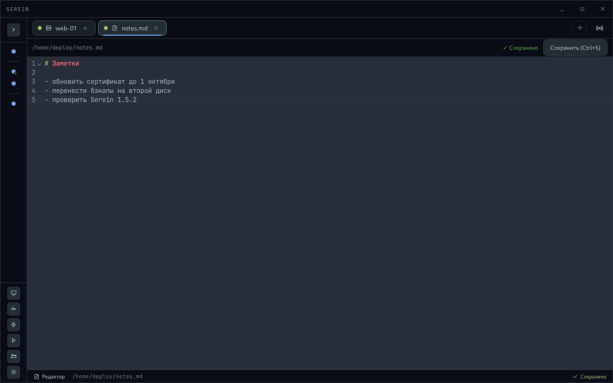

Файл открывается отдельной вкладкой с подсветкой синтаксиса. `Ctrl+S` сохраняет прямо на
сервер. Внизу видно, сохранён файл или нет.

Если файл на сервере успели изменить, пока вы его правили (например, коллега), Serein не
затрёт чужую правку молча и спросит:

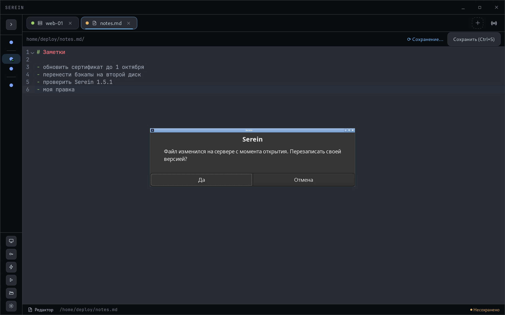

«Отмена» оставляет файл на сервере как есть, ваша правка остаётся в редакторе - её можно
скопировать или открыть файл заново. Закрыть вкладку с несохранённой правкой Serein тоже
не даст без вопроса.

### Сравнить папку с сервером

В двухпанельном режиме кнопка «Сравнить с сервером» сравнивает папку на компьютере с
открытой папкой на сервере.

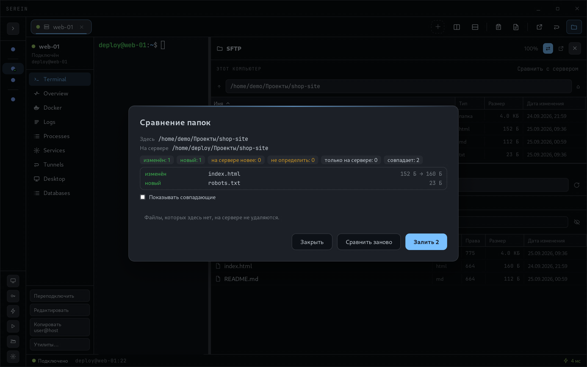

Файлы делятся на новые, изменённые, «на сервере новее», «только на сервере», «не
определить» и совпадающие. «Залить N» отправит на сервер только новые и изменённые, а
перед этим ещё раз проверит сервер: если файл там поменяли после сравнения, заливка
остановится. На сервере при этом ничего не удаляется.

---

## 8. Docker

Инструмент **Docker** показывает контейнеры сервера с загрузкой процессора и памяти,
портами и состоянием проверки здоровья (`healthy`).

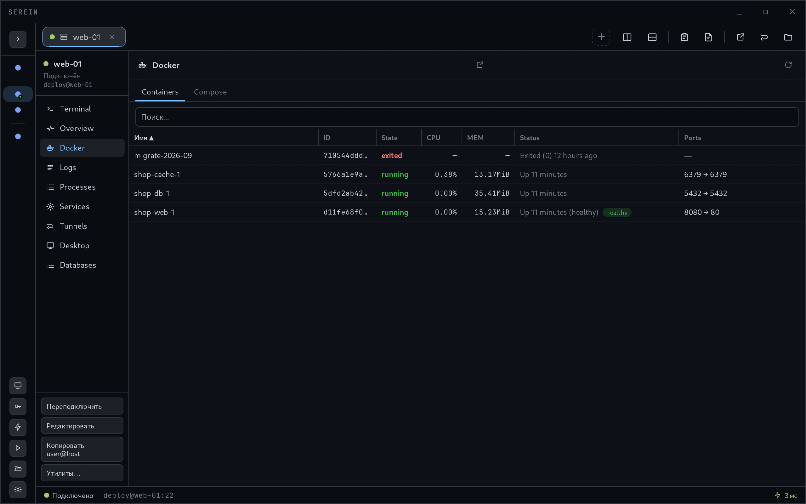

Поиск над таблицей понимает несколько слов сразу, любой столбец сортируется щелчком по
заголовку. Правая кнопка по контейнеру - «Открыть» и «Свойства».

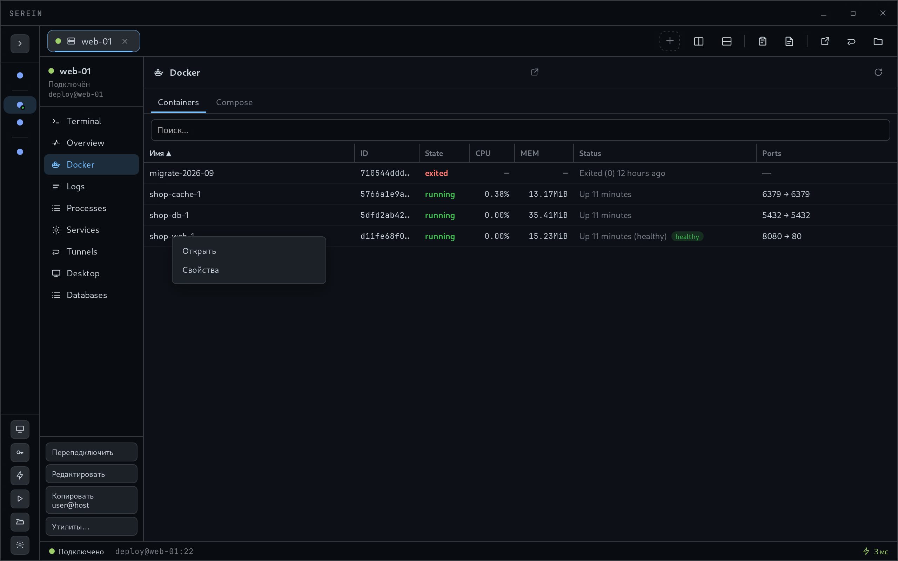

Карточка контейнера: состояние, образ, порты, кнопки **Shell** (консоль внутри
контейнера), **Files** (файлы контейнера), **Restart**, **Stop** и живые логи.

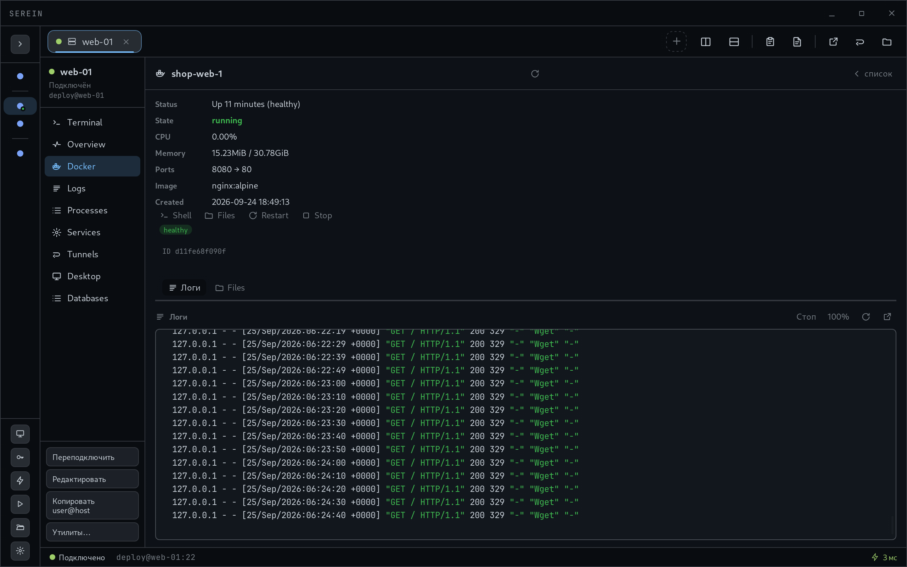

У логов есть масштаб, пауза («Стоп») и кнопка «Открепить» - логи можно вынести в
отдельное окно.

### Docker Compose

Вкладка **Compose** - проекты Compose на сервере. Внутри проекта: сервисы, кнопки
**Up** и **Down** для всего проекта, у каждого сервиса консоль, логи, перезапуск и
остановка, а кнопка **YAML** показывает файл проекта.

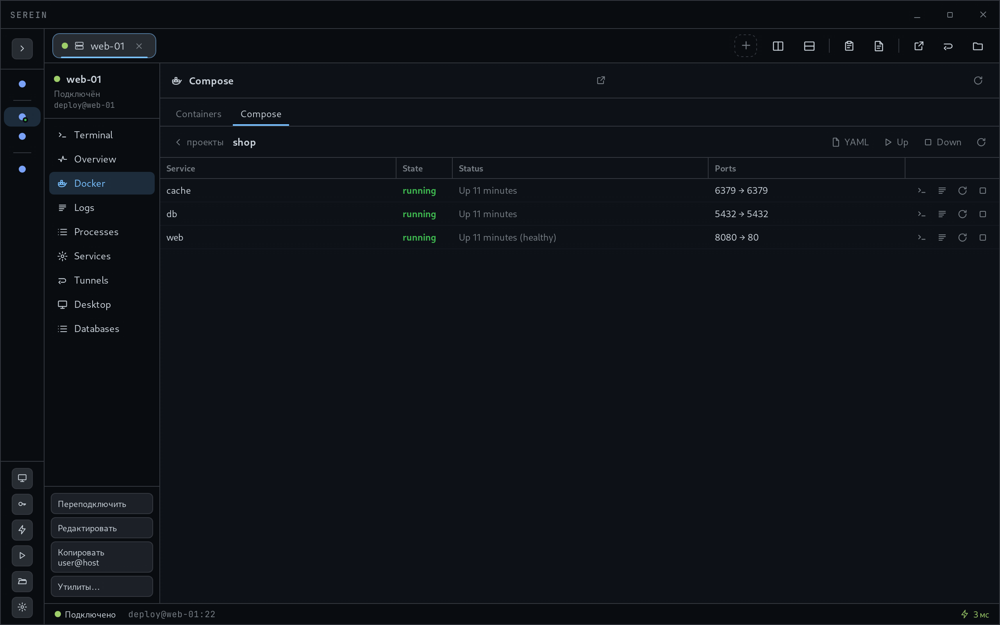

Удаление контейнера и остановка проекта (`Down`) спрашивают подтверждение.

---

## 9. Логи сервера

Инструмент **Logs** показывает системный журнал сервера (`journalctl`). Уровни
подсвечены: предупреждения жёлтым, ошибки красным.

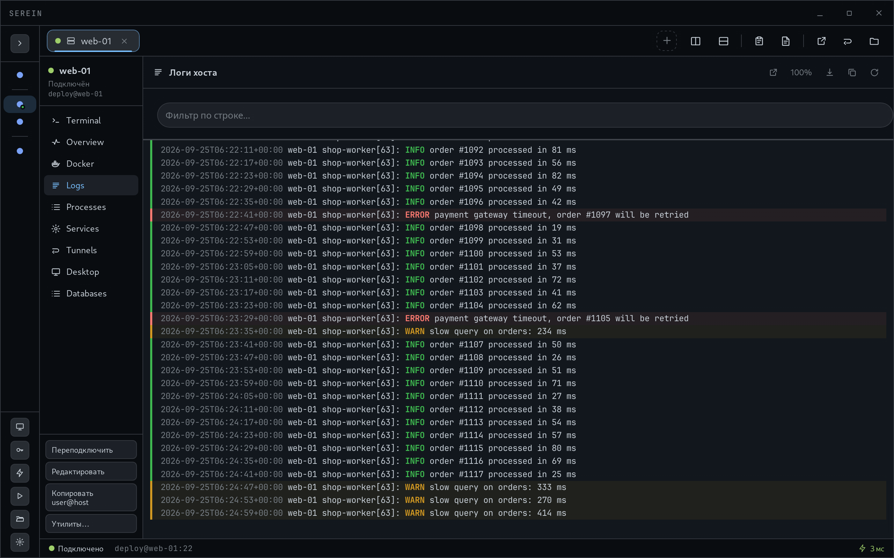

Строка фильтра оставляет только нужные строки:

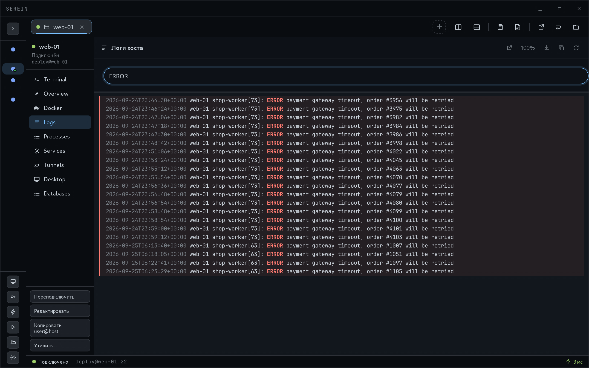

Кнопки в шапке: открепить в отдельное окно, масштаб, **выгрузить отчёт по ошибкам** в
текстовый файл, скопировать видимое, обновить.

---

## 10. Процессы

Инструмент **Processes** - таблица процессов сервера с поиском (по имени, пользователю,
PID, состоянию, можно несколько слов) и сортировкой по любому столбцу.

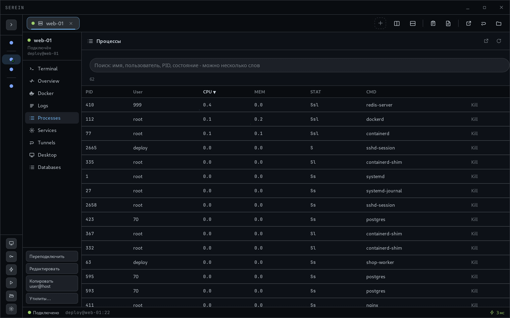

**Kill** завершает процесс, перед этим Serein спросит подтверждение. Завершить можно
только процессы, на которые у вашего пользователя есть права.

---

## 11. Службы

Инструмент **Services** - службы сервера (systemd, OpenRC или службы Windows). Фильтр
понимает имя, описание и состояние: например, `failed` оставит только упавшие.

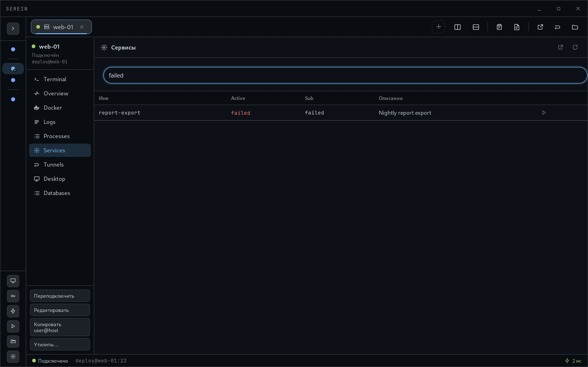

Кнопки в строке: запустить, перезапустить, остановить. Serein спросит подтверждение.

> **Важно про права.** Serein управляет службами от имени того пользователя, под которым
> вы вошли, и пароль `sudo` для этого не спрашивает. Если вы вошли не как `root`, нужен
> доступ к управлению службами, иначе увидите ошибку systemd
> «Interactive authentication required». Обычно администратор выдаёт такой доступ правилом
> polkit для нужных служб. Смотреть список и состояние служб можно без всяких прав.

---

## 12. Туннели (проброс портов)

Туннель делает так, чтобы порт на сервере (или в его сети) был доступен на вашем
компьютере, и наоборот.

Туннели задаются в карточке сервера («Туннели при подключении» → «+ Добавить») и
поднимаются вместе с подключением:

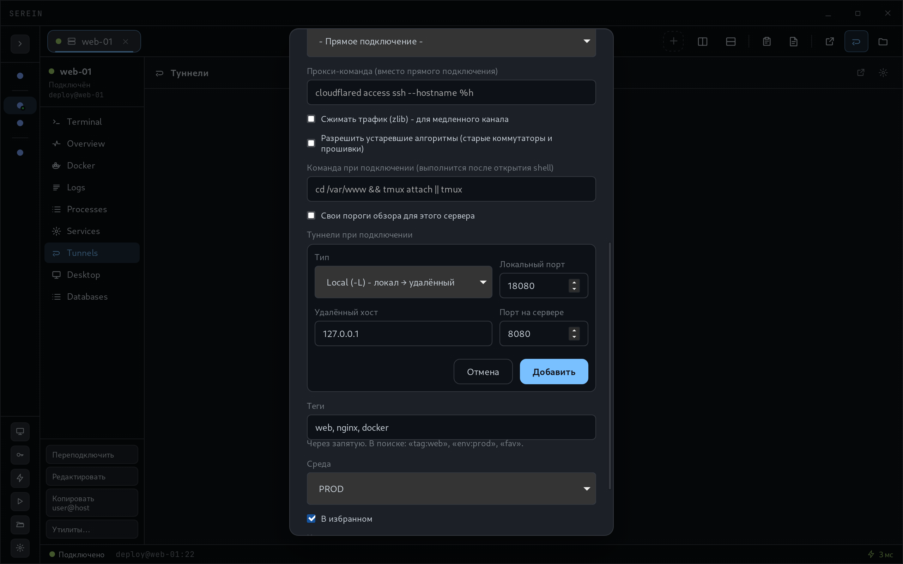

- **Local (-L)** - порт на вашем компьютере ведёт к адресу, как его видит сервер. Например,
  `127.0.0.1:18080` на компьютере открывает сайт, который на сервере слушает
  `127.0.0.1:8080`.
- **Remote (-R)** - наоборот: порт на сервере ведёт к вашему компьютеру.
- **Dynamic SOCKS5 (-D)** - прокси: браузер, настроенный на него, ходит в интернет
  «от имени» сервера.

Инструмент **Tunnels** показывает туннели сервера, их состояние и кнопки «Старт» / «Стоп»:

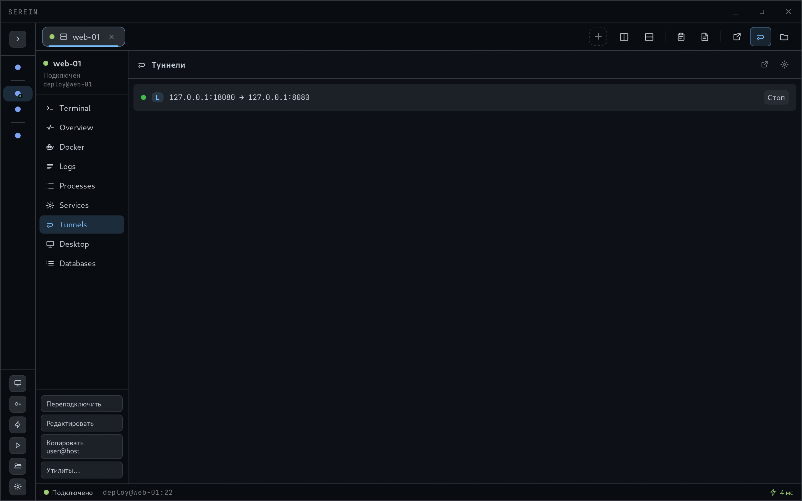

---

## 13. Базы данных

Инструмент **Databases** подключается к базе на сервере через уже открытое SSH-соединение.
Открывать порт базы наружу или поднимать туннель не нужно.

Поддерживаются PostgreSQL, MySQL и MariaDB, SQL Server, MongoDB, Redis и SQLite (файл на
сервере). Адрес указывается так, как его видит сервер, обычно `127.0.0.1`.

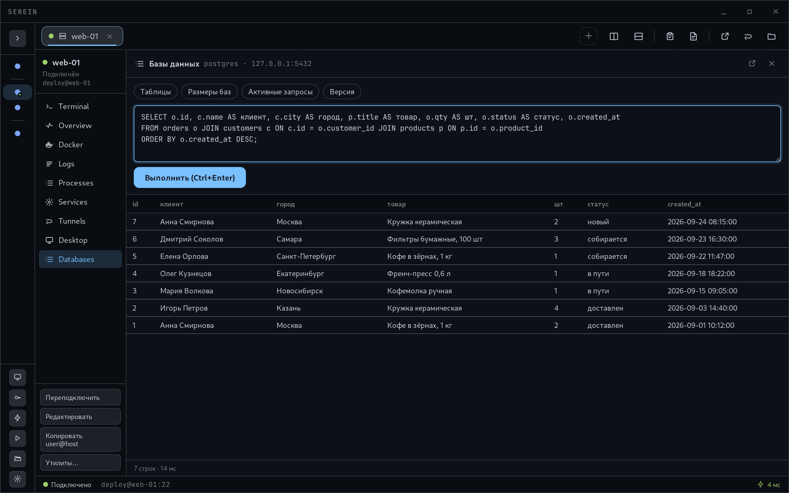

- Кнопки над полем - готовые запросы: таблицы, размеры баз, активные запросы, версия.
- `Ctrl+Enter` выполняет запрос. Результат листается по 200 строк; если наборов
  несколько, между ними есть переключатель. Долгий запрос можно остановить, а через
  28 секунд база остановит его сама.
- MongoDB понимает запросы как в mongosh: `db.orders.find().sort().limit()`, `aggregate`,
  подсчёт, вставка, изменение, удаление, индексы, `show dbs`, `use`.

Опасные запросы - `DELETE` и `UPDATE` без `WHERE`, `DROP`, `TRUNCATE`, `FLUSHALL` и
удаление коллекций - Serein выполнит только после подтверждения:

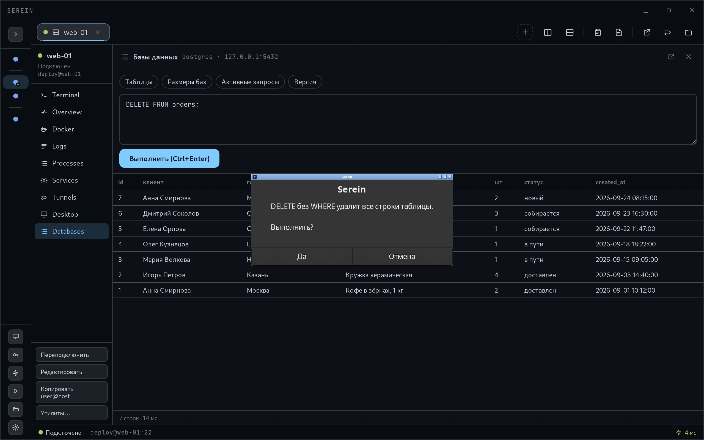

---

## 14. Рабочий стол: VNC и RDP

Инструмент **Desktop** открывает графический рабочий стол сервера прямо во вкладке. Всё
идёт внутри SSH-соединения: открывать порты VNC или RDP наружу не нужно.

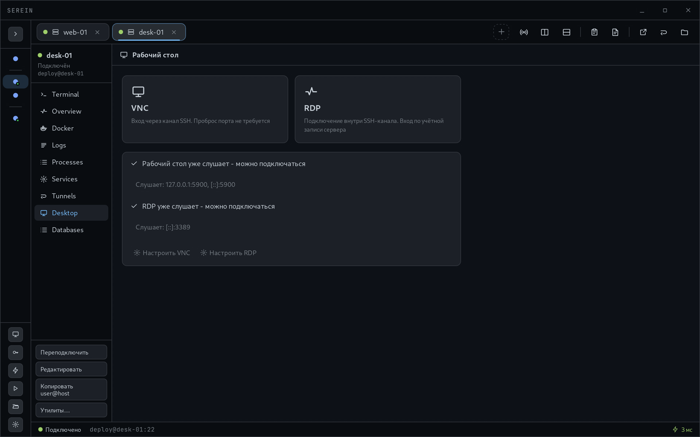

Сначала Serein проверяет, что есть на сервере, и пишет это словами: «рабочий стол уже
слушает - можно подключаться», «установлен, но не запущен» или «на сервере нет». Если
серверной части нет, «Настроить VNC» или «Настроить RDP» поставят и запустят её
(понадобится пароль `sudo` - он уходит серверу напрямую и нигде не сохраняется).

### VNC

Нажмите «VNC», введите пароль VNC (он свой, не пароль от сервера) - и рабочий стол на
экране.

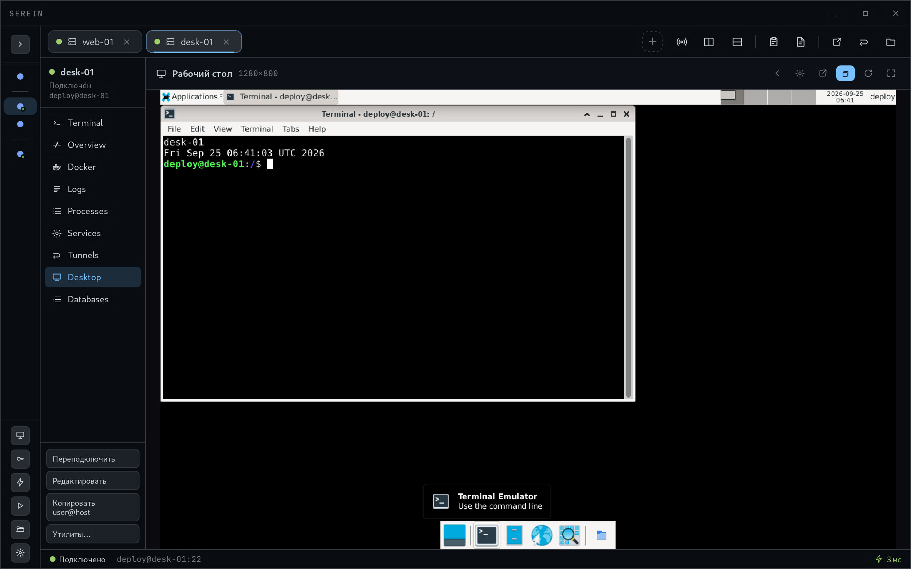

### RDP

Для RDP введите пользователя и пароль учётной записи на сервере. Здесь же:

- **Разрешение** - «по размеру окна» или фиксированное.
- **Цвет** и **Сеть** - для VPN и медленных каналов есть экономный профиль: 16-битный
  цвет, без обоев и анимации.
- **Передавать сочетания клавиш** - Win, Alt+Tab и подобные уходят на удалённый стол,
  пока он в фокусе. Вернуть клавиатуру себе - `Ctrl+Alt+Pause` или `Ctrl+Alt+Home`.
- **Входить сразу** - без окна входа на самом сервере.

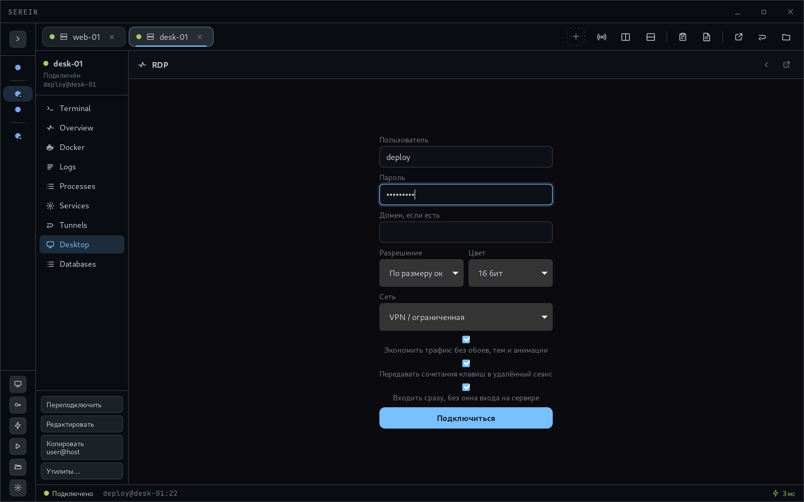

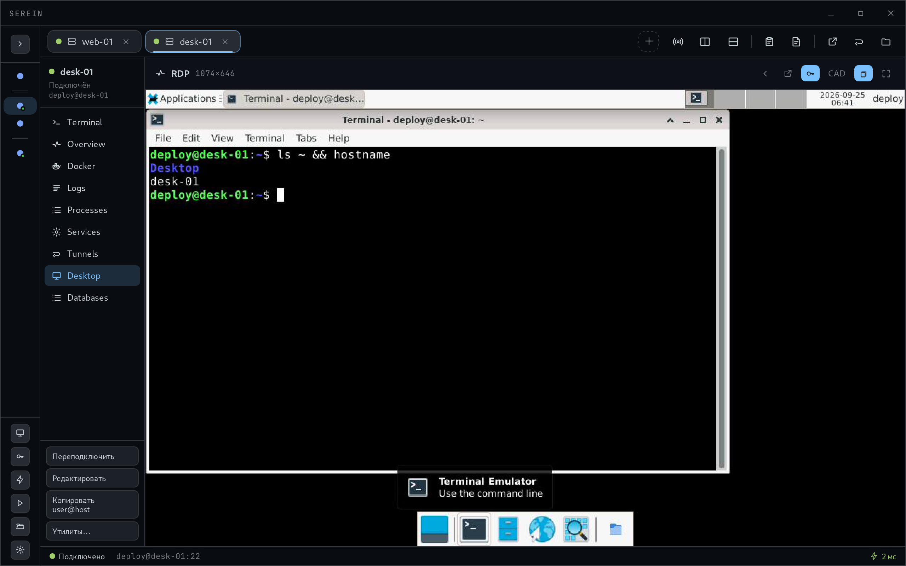

При растягивании окна разрешение рабочего стола подстраивается само, без
переподключения. Кнопки в шапке: открепить в отдельное окно, перехват клавиш, `CAD`
(Ctrl+Alt+Del), один к одному, весь экран.

---

## 15. Утилиты

Кнопка «Утилиты» внизу слева открывает вкладку с сетевыми проверками. Большую часть из
них можно запускать **с этого компьютера или с любого подключённого сервера** - поле
«Откуда».

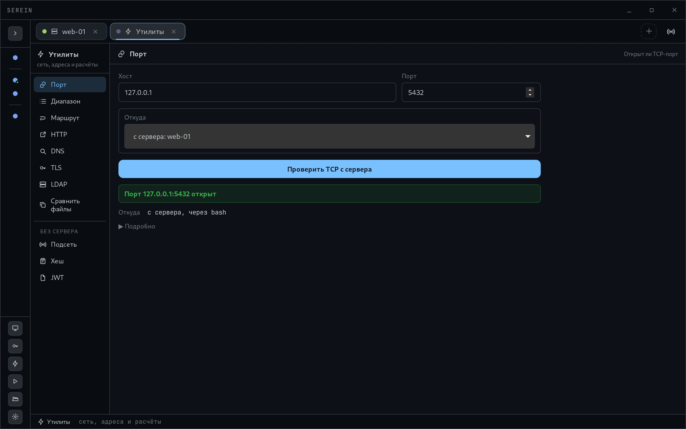

- **Порт** - открыт ли TCP-порт.
- **Диапазон** - какие порты открыты в диапазоне.
- **Маршрут** - трассировка до адреса.
- **HTTP** - что отвечает веб-служба: код, заголовки.
- **DNS**, **TLS** (сертификат сайта и срок его действия), **LDAP** (запрос к каталогу).
- **Сравнить файлы** - в том числе файлы на сервере.
- Без сервера: **Подсеть** (калькулятор сетей), **Хеш**, **JWT** (разбор токена).

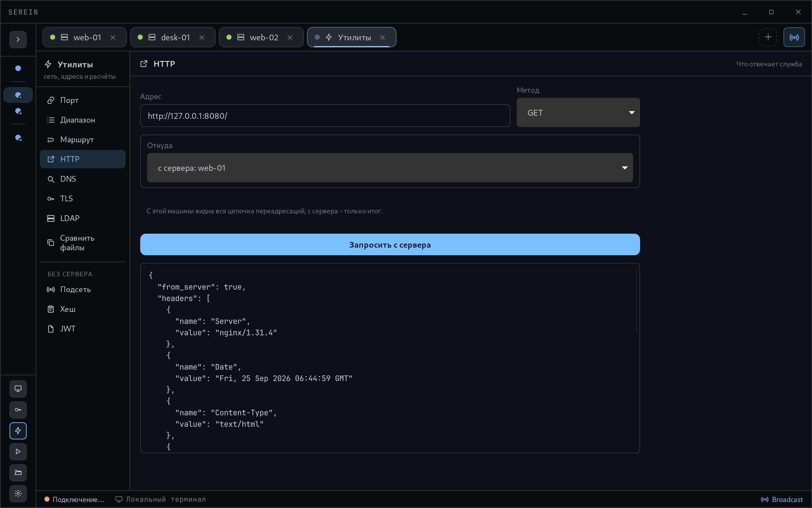

Проверка «с сервера» показывает то, что видит сам сервер: например, сайт, который слушает
только внутри сервера и снаружи недоступен. Результат выводится как есть, в виде
структурированных данных.

---

## 16. Одна команда на нескольких серверах

Правая кнопка по пустому месту списка серверов → **«Выполнить на нескольких…»**.

Введите команду, отметьте серверы или целые группы, выберите, сколько серверов
обрабатывать одновременно и сколько ждать каждый. Перед запуском Serein покажет, что и где
будет выполнено:

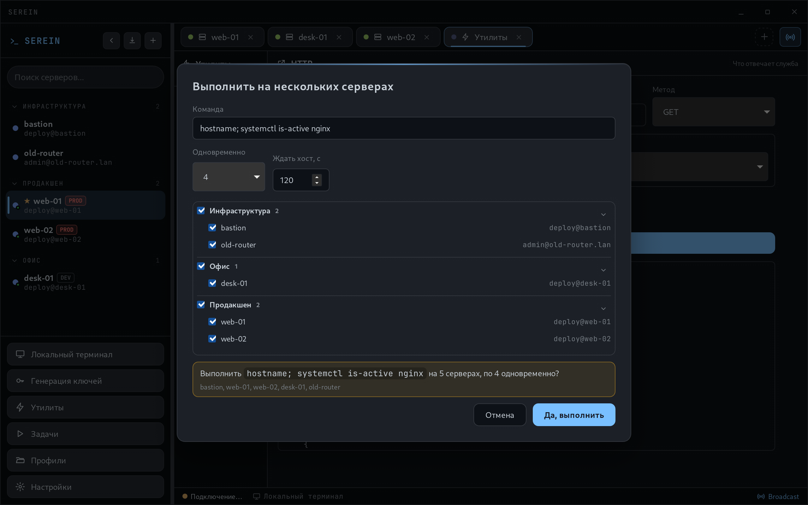

Результат приходит по каждому серверу отдельно, как только сервер ответил:

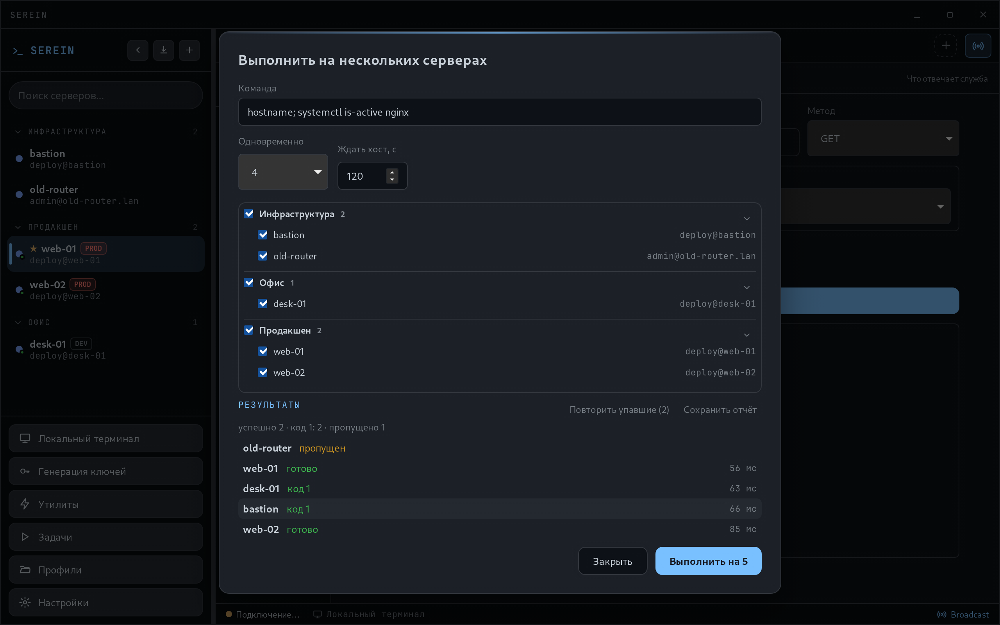

- **готово** - команда выполнилась, **код N** - завершилась с ошибкой, **не дошли** - не
  удалось подключиться.
- **пропущен** - ключ сервера ещё не подтверждён. Serein не доверяет незнакомому серверу
  молча: подключитесь к нему один раз обычным способом.
- Щелчок по строке показывает вывод. «Повторить упавшие» перезапустит команду только там,
  где она не удалась, «Сохранить отчёт» запишет итог в файл.

---

## 17. Задачи

Задача - несколько шагов по порядку на выбранных серверах. Кнопка «Задачи» внизу слева.

Проще всего начать с шаблона («Из шаблона…»): перезапуск службы с проверкой, выкладка
сайта, обновление контейнеров Compose.

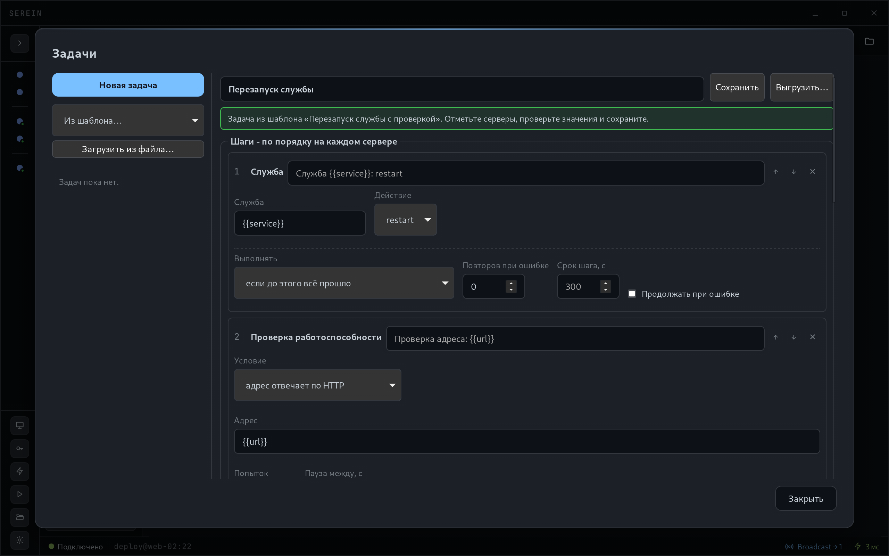

Шаги бывают такие: команда, загрузка на сервер, скачивание, синхронизация папки, служба,
контейнер Docker и проверка работоспособности (команда, порт или HTTP-адрес с самого
сервера).

У каждого шага есть:

- **Условие**: «если до этого всё прошло», «только если задача остановилась на ошибке» (для
  отката) или «в любом случае».
- **Повторы** при ошибке, **срок шага** и галочка **«продолжать при ошибке»**.

**Переменные** пишутся в полях как `{{имя}}`, значения задаются ниже или спрашиваются
перед запуском. Секрет не сохраняется и в выводе заменяется на `••••`. **Среды** (prod,
stage) задают свои значения и серверы.

Прежде чем запускать по-настоящему, нажмите **«Пробный прогон»**: Serein подключится ко
всем серверам и проверит, что служба существует, файлы на месте и так далее, ничего не
меняя. **«Запустить»** спросит подтверждение и покажет ход по каждому серверу и шагу:

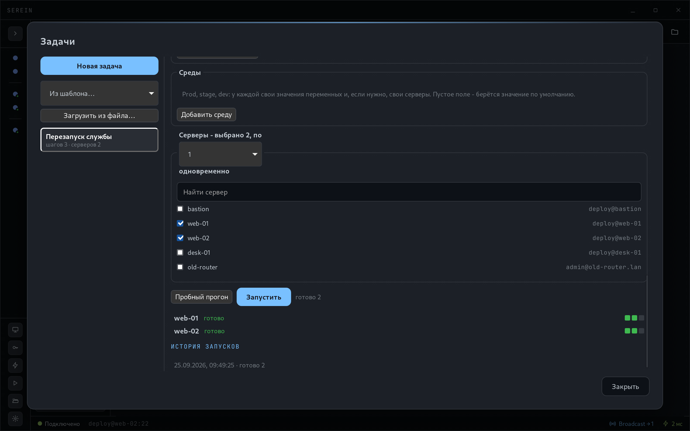

Зелёные квадраты - выполненные шаги, серые - пропущенные по условию. Внизу история
последних 50 запусков. Задачу можно выгрузить в файл («Выгрузить…») и загрузить на другом
компьютере - серверы найдутся по адресу и имени, секреты в файл не попадают.

---

## 18. Профили рабочего пространства

Профиль запоминает набор вкладок: какие серверы открыты, как разделено окно, какие
инструменты выбраны. Кнопка «Профили» внизу слева.

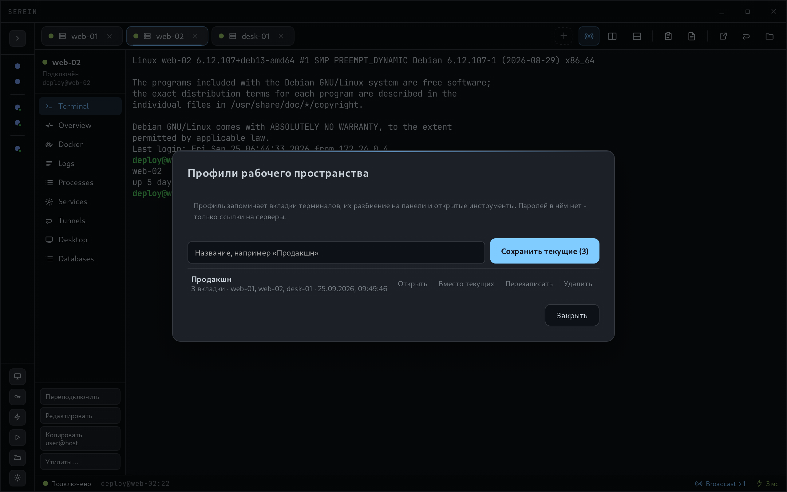

Впишите название («Продакшн», «Логи») и нажмите «Сохранить текущие». Потом профиль можно
**открыть** рядом с текущими вкладками или **вместо текущих**, **перезаписать** или
удалить. Паролей в профиле нет - только ссылки на серверы.

---

## 19. SSH-ключи

Кнопка «Генерация ключей» внизу слева.

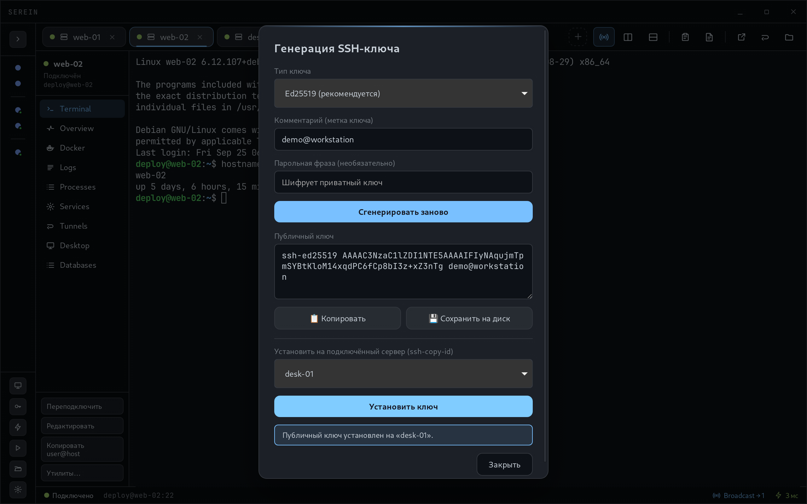

1. Выберите тип (Ed25519 подходит почти всегда), впишите комментарий и, если хотите,
   парольную фразу.
2. Нажмите «Сгенерировать». Публичный ключ можно скопировать или сохранить на диск.
3. В поле «Установить на подключённый сервер» выберите сервер и нажмите «Установить
   ключ» - ключ добавится в `authorized_keys` на сервере (как `ssh-copy-id`). После этого
   в карточке сервера можно выбрать вход по ключу.

---

## 20. Локальный терминал, COM-порт и telnet

### Локальный терминал

Кнопка «Локальный терминал» внизу слева или `Ctrl+Shift+T` - консоль этого компьютера.
Какую оболочку запускать (PowerShell, cmd, bash и т. д.), выбирается в настройках.

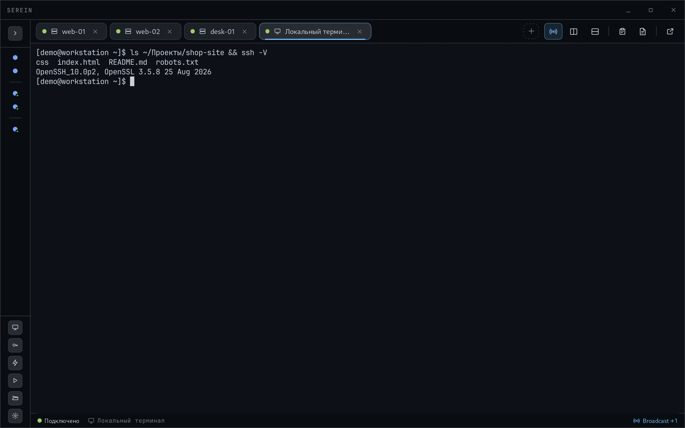

### COM-порт

Для консоли сетевого железа по кабелю выберите в карточке сервера тип «Последовательный
порт (COM)»: порт, скорость, биты данных, стоп-биты, чётность, управление потоком, DTR и
RTS.

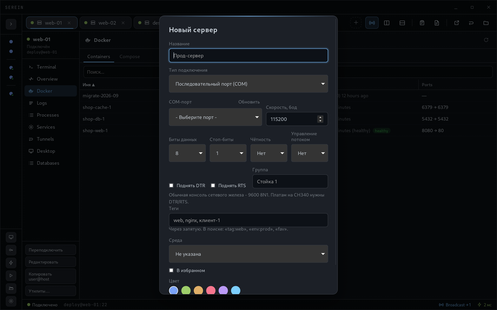

### Telnet и TCP без обработки

Тип «Telnet» - для старого оборудования: адрес, порт и что отправляет клавиша `Enter`
(обычно подходит CR LF). Логин и пароль спросит само устройство. Помните, что telnet не
шифрует трафик. «TCP без обработки» передаёт байты как есть - для консольных серверов.

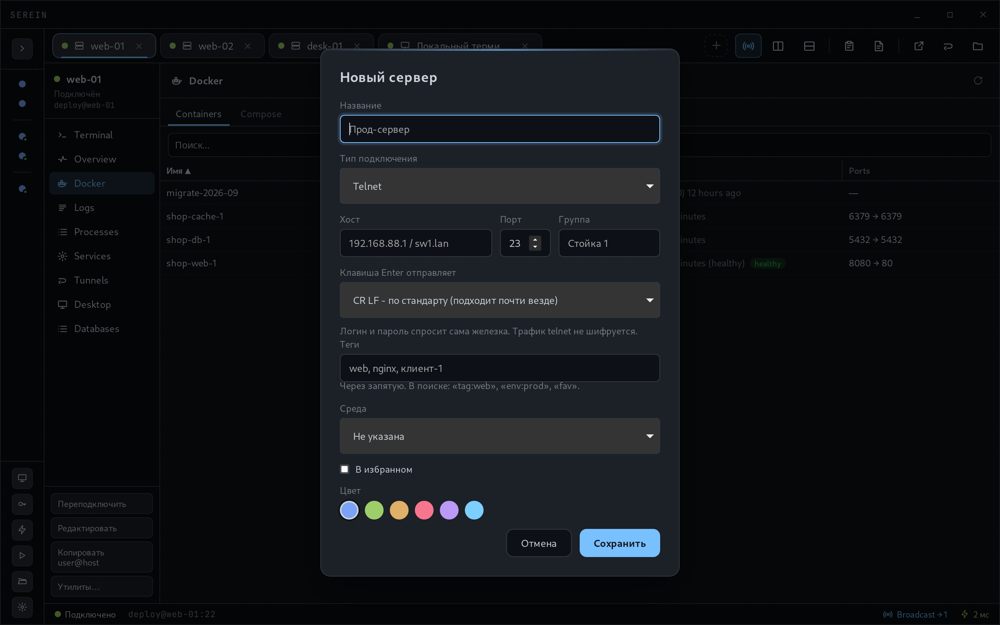

---

## 21. Настройки

Кнопка «Настройки» внизу слева или `Ctrl+,`. Изменения применяются сразу, «Готово» просто
закрывает окно.

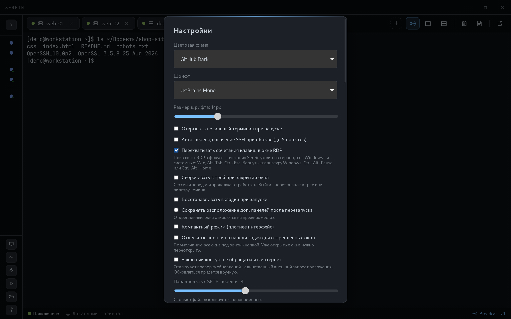

- **Цветовая схема** - 17 тем на весь интерфейс, светлые тоже есть.
- **Шрифт и размер** терминала.
- **Поведение**: открывать локальный терминал при запуске, автопереподключение,
  перехват сочетаний в RDP, сворачивать в трей при закрытии (на Windows включено по
  умолчанию: закрытое окно продолжает работать в трее), восстанавливать вкладки при
  запуске, компактный режим.
- **Закрытый контур** - запрещает Serein обращаться в интернет. Единственное, что
  программа делает в интернете сама, - проверяет обновления, и эта галочка это выключает.
- **Файлы**: сколько передач одновременно, какие колонки показывать.
- **Оболочка локального терминала** и **внешний редактор**.
- **Пороги обзора сервера** - с какого значения «внимание» и «плохо».
- **Горячие клавиши** - щёлкните по сочетанию и нажмите новое (`Esc` - отмена,
  `Backspace` - вернуть по умолчанию).

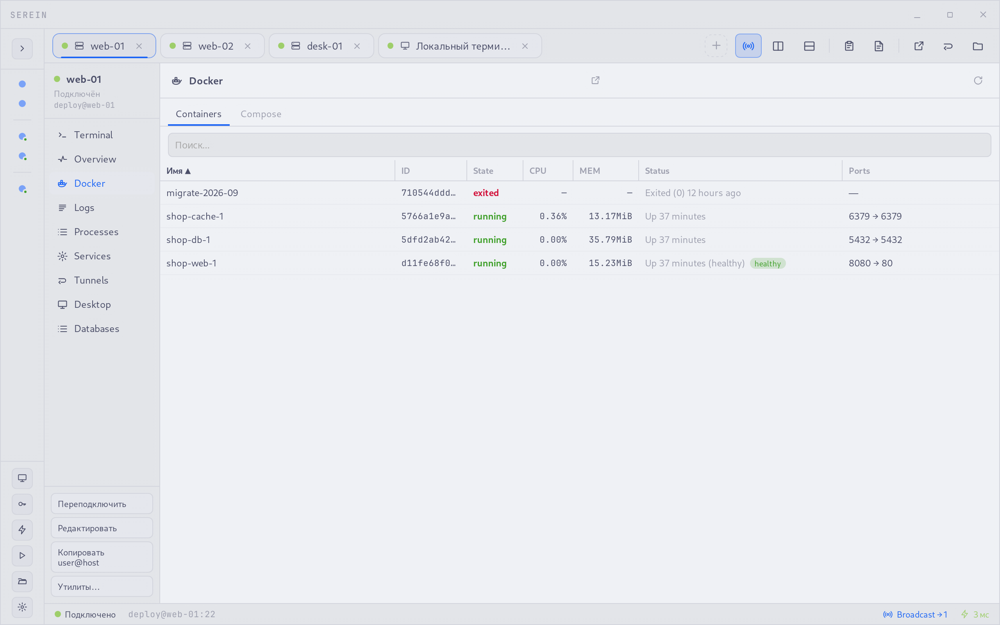

### Безопасность и хранение

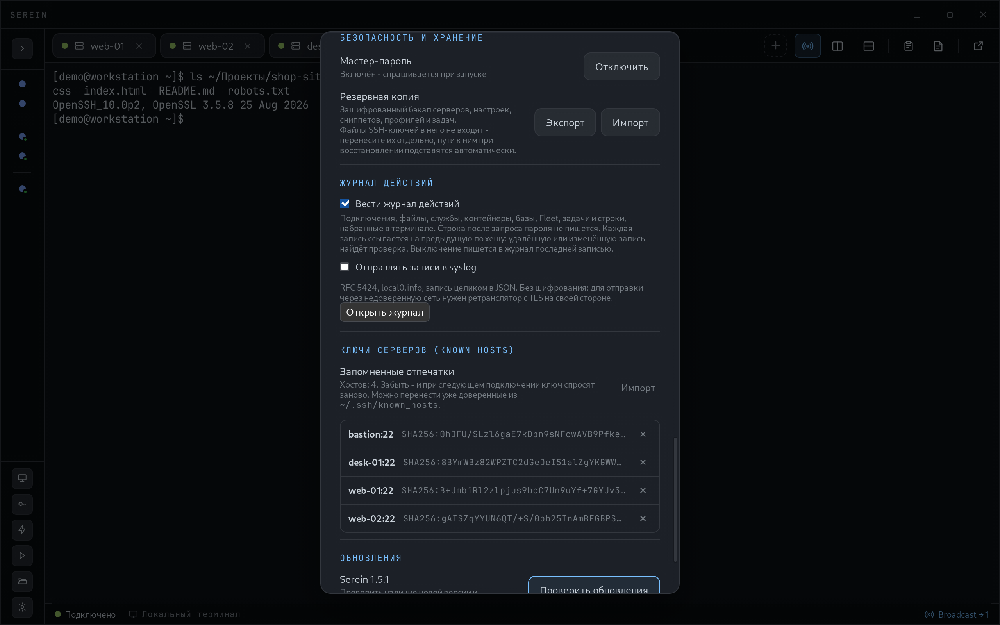

- **Мастер-пароль** - дополнительная защита сохранённых паролей и ключей. Serein будет
  спрашивать его при каждом запуске. Минимум 12 символов; удобнее фраза из нескольких
  слов, спецсимволы не обязательны. Запомните его: без мастер-пароля сохранённые пароли не
  расшифровать.

  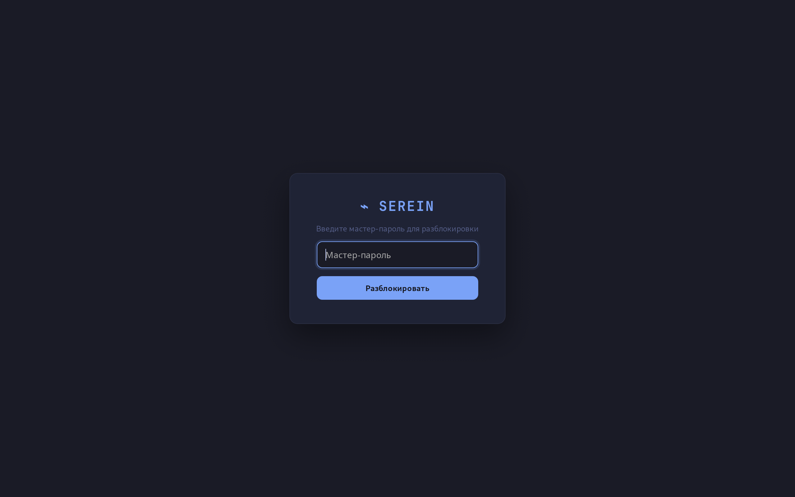

- **Резервная копия** - «Экспорт» сохраняет серверы, настройки, сниппеты, профили и
  задачи в зашифрованный файл `.tbk` под паролем, «Импорт» восстанавливает. Файлы SSH-ключей
  туда не входят: перенесите их отдельно.
- **Журнал действий** - см. [раздел 22](#22-журнал-действий).
- **Ключи серверов** - запомненные отпечатки. Крестик «забывает» сервер: при следующем
  подключении его ключ спросят заново. «Импорт» забирает уже доверенные ключи из
  `~/.ssh/known_hosts`.
- **Обновления** - текущая версия и кнопка «Проверить обновления».
- **Профиль и логи** - где лежат данные Serein.

---

## 22. Журнал действий

Serein записывает, что и на каких серверах вы делали: подключения, файлы, службы,
контейнеры, базы, туннели, задачи, рабочие столы и строки, набранные в терминале. То, что
набрано после запроса пароля, **не записывается** - вместо строки в журнале пометка
«набрано после запроса пароля - не записано».

Открыть журнал - «Открыть журнал» в настройках или через командную палитру.

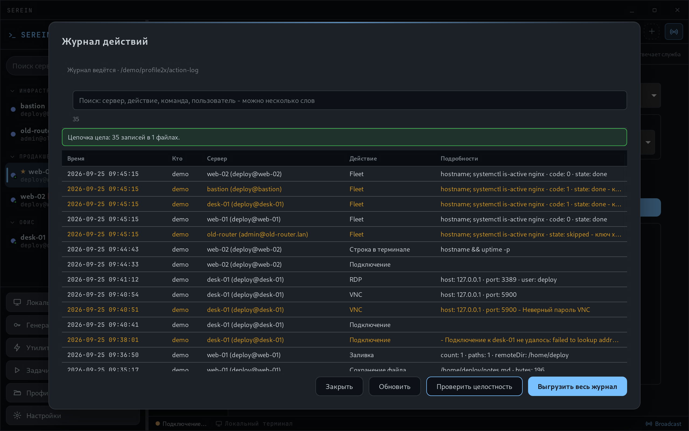

- Поиск понимает сервер, действие, команду и пользователя.
- **Проверить целостность** - каждая запись ссылается на предыдущую, поэтому удалённую
  или изменённую запись проверка найдёт.
- **Выгрузить весь журнал** - в файл.
- В настройках журнал можно отправлять в syslog или SIEM организации. Выключение журнала
  само записывается в журнал последней строкой.

Для администраторов: политикой можно зафиксировать настройки, разрешить подключение
только к перечисленным серверам, запретить хранить пароли, потребовать мастер-пароль и
многое другое. Подробности - в [SECURITY.md](../../SECURITY.md) и шаблонах групповых
политик в [docs/policy](../policy).

---

## 23. Горячие клавиши

| Действие | Клавиши |
| --- | --- |
| Командная палитра, переход к серверу | `Ctrl+Shift+P` |
| Новый локальный терминал | `Ctrl+Shift+T` |
| Закрыть вкладку | `Ctrl+Shift+W` |
| Следующая / предыдущая вкладка | `Ctrl+Tab` / `Ctrl+Shift+Tab` |
| Разделить: панели рядом / друг над другом | `Ctrl+Shift+E` / `Ctrl+Shift+D` |
| Закрыть активную панель | `Ctrl+Shift+X` |
| Следующая / предыдущая панель | `Alt+]` / `Alt+[` |
| Файлы (SFTP) | `Ctrl+Shift+F` |
| Ввод во все панели | `Ctrl+Shift+B` |
| Настройки | `Ctrl+,` |
| Копировать / вставить в терминале | `Ctrl+Shift+C` / `Ctrl+Shift+V` |
| Поиск в терминале | `Ctrl+F` |
| Выполнить запрос к базе | `Ctrl+Enter` |
| Сохранить файл в редакторе | `Ctrl+S` |
| Масштаб файлов и логов | `Ctrl` + колесо, `Ctrl` `+` / `-` / `0` |
| Вернуть клавиатуру из RDP | `Ctrl+Alt+Pause` или `Ctrl+Alt+Home` |

Сочетания из первых десяти строк можно поменять в настройках.

---

## 24. Если что-то не получается

**Не подключается к серверу.** В терминале, внизу вкладки и в строке состояния написано, что
именно не получилось: например, имя сервера не нашлось в сети, сервер не ответил или не
принял пароль. Проверьте адрес и порт, пользователя, способ входа. Когда причина устранена,
нажмите «Переподключиться». Неверный пароль Serein повторно не отправляет, чтобы сервер вас
не заблокировал.

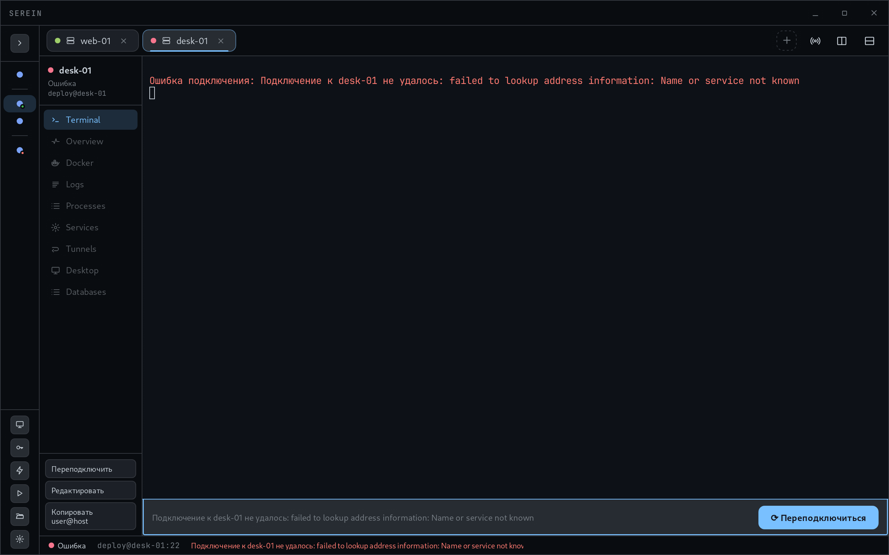

**Сервер за шлюзом подключается напрямую.** Откройте карточку сервера и проверьте поле
«Подключаться через».

**«Ключ хоста не подтверждён» в командах на нескольких серверах или в задачах.**
Подключитесь к этому серверу один раз обычным способом и подтвердите отпечаток.

**Служба не перезапускается: «Interactive authentication required».** У вашего
пользователя нет прав управлять службами - см. [раздел 11](#11-службы).

**Рабочий стол: «на сервере нет».** Нажмите «Настроить VNC» или «Настроить RDP» -
Serein поставит нужное. Для VNC нужен пароль VNC, а не пароль от сервера.

**Список серверов вдруг пуст.** Проверьте в самом низу настроек путь к профилю: запуск
под другим пользователем открывает другой профиль.

**Забыли мастер-пароль.** Сохранённые пароли без него не расшифровать. Серверы можно
восстановить из резервной копии, а пароли придётся ввести заново.

**Нашли ошибку.** Опишите, что делали и что увидели, в
[issues на GitHub](../../../../issues). Журнал подключения к рабочему столу лежит в папке
`logs` профиля.
